# Question

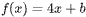

For the linear function <mjx-container alttext="f" aria-label="f" class="MathJax CtxtMenu_Attached_0" ctxtmenu_counter="205" jax="SVG" role="img" style="position: relative;" tabindex="0"><svg aria-hidden="true" focusable="false" height="2.059ex" role="img" style="vertical-align: -0.464ex;" viewbox="0 -705 550 910" width="1.244ex" xmlns="http://www.w3.org/2000/svg" xmlns:xlink="http://www.w3.org/1999/xlink"><defs><path d="M118 -162Q120 -162 124 -164T135 -167T147 -168Q160 -168 171 -155T187 -126Q197 -99 221 27T267 267T289 382V385H242Q195 385 192 387Q188 390 188 397L195 425Q197 430 203 430T250 431Q298 431 298 432Q298 434 307 482T319 540Q356 705 465 705Q502 703 526 683T550 630Q550 594 529 578T487 561Q443 561 443 603Q443 622 454 636T478 657L487 662Q471 668 457 668Q445 668 434 658T419 630Q412 601 403 552T387 469T380 433Q380 431 435 431Q480 431 487 430T498 424Q499 420 496 407T491 391Q489 386 482 386T428 385H372L349 263Q301 15 282 -47Q255 -132 212 -173Q175 -205 139 -205Q107 -205 81 -186T55 -132Q55 -95 76 -78T118 -61Q162 -61 162 -103Q162 -122 151 -136T127 -157L118 -162Z" id="MJX-206-TEX-I-1D453"></path></defs><g fill="currentColor" stroke="currentColor" stroke-width="0" transform="scale(1,-1)"><g data-mml-node="math"><g data-mml-node="mi"><use data-c="1D453" xlink:href="#MJX-206-TEX-I-1D453"></use></g></g></g></svg><mjx-assistive-mml display="inline" unselectable="on"><math alttext="f" xmlns="http://www.w3.org/1998/Math/MathML"><mi>f</mi></math></mjx-assistive-mml></mjx-container>, <mjx-container alttext="b" aria-label="b" class="MathJax CtxtMenu_Attached_0" ctxtmenu_counter="206" jax="SVG" role="img" style="position: relative;" tabindex="0"><svg aria-hidden="true" focusable="false" height="1.595ex" role="img" style="vertical-align: -0.025ex;" viewbox="0 -694 429 705" width="0.971ex" xmlns="http://www.w3.org/2000/svg" xmlns:xlink="http://www.w3.org/1999/xlink"><defs><path d="M73 647Q73 657 77 670T89 683Q90 683 161 688T234 694Q246 694 246 685T212 542Q204 508 195 472T180 418L176 399Q176 396 182 402Q231 442 283 442Q345 442 383 396T422 280Q422 169 343 79T173 -11Q123 -11 82 27T40 150V159Q40 180 48 217T97 414Q147 611 147 623T109 637Q104 637 101 637H96Q86 637 83 637T76 640T73 647ZM336 325V331Q336 405 275 405Q258 405 240 397T207 376T181 352T163 330L157 322L136 236Q114 150 114 114Q114 66 138 42Q154 26 178 26Q211 26 245 58Q270 81 285 114T318 219Q336 291 336 325Z" id="MJX-207-TEX-I-1D44F"></path></defs><g fill="currentColor" stroke="currentColor" stroke-width="0" transform="scale(1,-1)"><g data-mml-node="math"><g data-mml-node="mi"><use data-c="1D44F" xlink:href="#MJX-207-TEX-I-1D44F"></use></g></g></g></svg><mjx-assistive-mml display="inline" unselectable="on"><math alttext="b" xmlns="http://www.w3.org/1998/Math/MathML"><mi>b</mi></math></mjx-assistive-mml></mjx-container> is a constant and 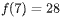. What is the value of <mjx-container alttext="b" aria-label="b" class="MathJax CtxtMenu_Attached_0" ctxtmenu_counter="208" jax="SVG" role="img" style="position: relative;" tabindex="0"><svg aria-hidden="true" focusable="false" height="1.595ex" role="img" style="vertical-align: -0.025ex;" viewbox="0 -694 429 705" width="0.971ex" xmlns="http://www.w3.org/2000/svg" xmlns:xlink="http://www.w3.org/1999/xlink"><defs><path d="M73 647Q73 657 77 670T89 683Q90 683 161 688T234 694Q246 694 246 685T212 542Q204 508 195 472T180 418L176 399Q176 396 182 402Q231 442 283 442Q345 442 383 396T422 280Q422 169 343 79T173 -11Q123 -11 82 27T40 150V159Q40 180 48 217T97 414Q147 611 147 623T109 637Q104 637 101 637H96Q86 637 83 637T76 640T73 647ZM336 325V331Q336 405 275 405Q258 405 240 397T207 376T181 352T163 330L157 322L136 236Q114 150 114 114Q114 66 138 42Q154 26 178 26Q211 26 245 58Q270 81 285 114T318 219Q336 291 336 325Z" id="MJX-209-TEX-I-1D44F"></path></defs><g fill="currentColor" stroke="currentColor" stroke-width="0" transform="scale(1,-1)"><g data-mml-node="math"><g data-mml-node="mi"><use data-c="1D44F" xlink:href="#MJX-209-TEX-I-1D44F"></use></g></g></g></svg><mjx-assistive-mml display="inline" unselectable="on"><math alttext="b" xmlns="http://www.w3.org/1998/Math/MathML"><mi>b</mi></math></mjx-assistive-mml></mjx-container>?

# Choices
* **A** 

<mjx-container alttext="0" aria-label="0" class="MathJax CtxtMenu_Attached_0" ctxtmenu_counter="209" jax="SVG" role="img" style="position: relative;" tabindex="0"><svg aria-hidden="true" focusable="false" height="1.557ex" role="img" style="vertical-align: -0.05ex;" viewbox="0 -666 500 688" width="1.131ex" xmlns="http://www.w3.org/2000/svg" xmlns:xlink="http://www.w3.org/1999/xlink"><defs><path d="M96 585Q152 666 249 666Q297 666 345 640T423 548Q460 465 460 320Q460 165 417 83Q397 41 362 16T301 -15T250 -22Q224 -22 198 -16T137 16T82 83Q39 165 39 320Q39 494 96 585ZM321 597Q291 629 250 629Q208 629 178 597Q153 571 145 525T137 333Q137 175 145 125T181 46Q209 16 250 16Q290 16 318 46Q347 76 354 130T362 333Q362 478 354 524T321 597Z" id="MJX-210-TEX-N-30"></path></defs><g fill="currentColor" stroke="currentColor" stroke-width="0" transform="scale(1,-1)"><g data-mml-node="math"><g data-mml-node="mn"><use data-c="30" xlink:href="#MJX-210-TEX-N-30"></use></g></g></g></svg><mjx-assistive-mml display="inline" unselectable="on"><math alttext="0" xmlns="http://www.w3.org/1998/Math/MathML"><mn>0</mn></math></mjx-assistive-mml></mjx-container>

* **B** 

<mjx-container alttext="1" aria-label="1" class="MathJax CtxtMenu_Attached_0" ctxtmenu_counter="210" jax="SVG" role="img" style="position: relative;" tabindex="0"><svg aria-hidden="true" focusable="false" height="1.507ex" role="img" style="vertical-align: 0px;" viewbox="0 -666 500 666" width="1.131ex" xmlns="http://www.w3.org/2000/svg" xmlns:xlink="http://www.w3.org/1999/xlink"><defs><path d="M213 578L200 573Q186 568 160 563T102 556H83V602H102Q149 604 189 617T245 641T273 663Q275 666 285 666Q294 666 302 660V361L303 61Q310 54 315 52T339 48T401 46H427V0H416Q395 3 257 3Q121 3 100 0H88V46H114Q136 46 152 46T177 47T193 50T201 52T207 57T213 61V578Z" id="MJX-211-TEX-N-31"></path></defs><g fill="currentColor" stroke="currentColor" stroke-width="0" transform="scale(1,-1)"><g data-mml-node="math"><g data-mml-node="mn"><use data-c="31" xlink:href="#MJX-211-TEX-N-31"></use></g></g></g></svg><mjx-assistive-mml display="inline" unselectable="on"><math alttext="1" xmlns="http://www.w3.org/1998/Math/MathML"><mn>1</mn></math></mjx-assistive-mml></mjx-container>

* **C** 

<mjx-container alttext="4" aria-label="4" class="MathJax CtxtMenu_Attached_0" ctxtmenu_counter="211" jax="SVG" role="img" style="position: relative;" tabindex="0"><svg aria-hidden="true" focusable="false" height="1.532ex" role="img" style="vertical-align: 0px;" viewbox="0 -677 500 677" width="1.131ex" xmlns="http://www.w3.org/2000/svg" xmlns:xlink="http://www.w3.org/1999/xlink"><defs><path d="M462 0Q444 3 333 3Q217 3 199 0H190V46H221Q241 46 248 46T265 48T279 53T286 61Q287 63 287 115V165H28V211L179 442Q332 674 334 675Q336 677 355 677H373L379 671V211H471V165H379V114Q379 73 379 66T385 54Q393 47 442 46H471V0H462ZM293 211V545L74 212L183 211H293Z" id="MJX-212-TEX-N-34"></path></defs><g fill="currentColor" stroke="currentColor" stroke-width="0" transform="scale(1,-1)"><g data-mml-node="math"><g data-mml-node="mn"><use data-c="34" xlink:href="#MJX-212-TEX-N-34"></use></g></g></g></svg><mjx-assistive-mml display="inline" unselectable="on"><math alttext="4" xmlns="http://www.w3.org/1998/Math/MathML"><mn>4</mn></math></mjx-assistive-mml></mjx-container>

* **D** 

<mjx-container alttext="7" aria-label="7" class="MathJax CtxtMenu_Attached_0" ctxtmenu_counter="212" jax="SVG" role="img" style="position: relative;" tabindex="0"><svg aria-hidden="true" focusable="false" height="1.579ex" role="img" style="vertical-align: -0.05ex;" viewbox="0 -676 500 698" width="1.131ex" xmlns="http://www.w3.org/2000/svg" xmlns:xlink="http://www.w3.org/1999/xlink"><defs><path d="M55 458Q56 460 72 567L88 674Q88 676 108 676H128V672Q128 662 143 655T195 646T364 644H485V605L417 512Q408 500 387 472T360 435T339 403T319 367T305 330T292 284T284 230T278 162T275 80Q275 66 275 52T274 28V19Q270 2 255 -10T221 -22Q210 -22 200 -19T179 0T168 40Q168 198 265 368Q285 400 349 489L395 552H302Q128 552 119 546Q113 543 108 522T98 479L95 458V455H55V458Z" id="MJX-213-TEX-N-37"></path></defs><g fill="currentColor" stroke="currentColor" stroke-width="0" transform="scale(1,-1)"><g data-mml-node="math"><g data-mml-node="mn"><use data-c="37" xlink:href="#MJX-213-TEX-N-37"></use></g></g></g></svg><mjx-assistive-mml display="inline" unselectable="on"><math alttext="7" xmlns="http://www.w3.org/1998/Math/MathML"><mn>7</mn></math></mjx-assistive-mml></mjx-container>

# Answer

# Rationale
<h5 class="cb-margin-bottom-16 cb-font-weight-bold">Rationale</h5>
Correct Answer: A

Choice A is correct. For the linear function <mjx-container alttext="f" aria-label="f" class="MathJax CtxtMenu_Attached_0" ctxtmenu_counter="213" jax="SVG" role="img" style="position: relative;" tabindex="0"><svg aria-hidden="true" focusable="false" height="2.059ex" role="img" style="vertical-align: -0.464ex;" viewbox="0 -705 550 910" width="1.244ex" xmlns="http://www.w3.org/2000/svg" xmlns:xlink="http://www.w3.org/1999/xlink"><defs><path d="M118 -162Q120 -162 124 -164T135 -167T147 -168Q160 -168 171 -155T187 -126Q197 -99 221 27T267 267T289 382V385H242Q195 385 192 387Q188 390 188 397L195 425Q197 430 203 430T250 431Q298 431 298 432Q298 434 307 482T319 540Q356 705 465 705Q502 703 526 683T550 630Q550 594 529 578T487 561Q443 561 443 603Q443 622 454 636T478 657L487 662Q471 668 457 668Q445 668 434 658T419 630Q412 601 403 552T387 469T380 433Q380 431 435 431Q480 431 487 430T498 424Q499 420 496 407T491 391Q489 386 482 386T428 385H372L349 263Q301 15 282 -47Q255 -132 212 -173Q175 -205 139 -205Q107 -205 81 -186T55 -132Q55 -95 76 -78T118 -61Q162 -61 162 -103Q162 -122 151 -136T127 -157L118 -162Z" id="MJX-214-TEX-I-1D453"></path></defs><g fill="currentColor" stroke="currentColor" stroke-width="0" transform="scale(1,-1)"><g data-mml-node="math"><g data-mml-node="mi"><use data-c="1D453" xlink:href="#MJX-214-TEX-I-1D453"></use></g></g></g></svg><mjx-assistive-mml display="inline" unselectable="on"><math alttext="f" xmlns="http://www.w3.org/1998/Math/MathML"><mi>f</mi></math></mjx-assistive-mml></mjx-container>, it’s given that . Substituting <mjx-container alttext="7" aria-label="7" class="MathJax CtxtMenu_Attached_0" ctxtmenu_counter="215" jax="SVG" role="img" style="position: relative;" tabindex="0"><svg aria-hidden="true" focusable="false" height="1.579ex" role="img" style="vertical-align: -0.05ex;" viewbox="0 -676 500 698" width="1.131ex" xmlns="http://www.w3.org/2000/svg" xmlns:xlink="http://www.w3.org/1999/xlink"><defs><path d="M55 458Q56 460 72 567L88 674Q88 676 108 676H128V672Q128 662 143 655T195 646T364 644H485V605L417 512Q408 500 387 472T360 435T339 403T319 367T305 330T292 284T284 230T278 162T275 80Q275 66 275 52T274 28V19Q270 2 255 -10T221 -22Q210 -22 200 -19T179 0T168 40Q168 198 265 368Q285 400 349 489L395 552H302Q128 552 119 546Q113 543 108 522T98 479L95 458V455H55V458Z" id="MJX-216-TEX-N-37"></path></defs><g fill="currentColor" stroke="currentColor" stroke-width="0" transform="scale(1,-1)"><g data-mml-node="math"><g data-mml-node="mn"><use data-c="37" xlink:href="#MJX-216-TEX-N-37"></use></g></g></g></svg><mjx-assistive-mml display="inline" unselectable="on"><math alttext="7" xmlns="http://www.w3.org/1998/Math/MathML"><mn>7</mn></math></mjx-assistive-mml></mjx-container> for <mjx-container alttext="x" aria-label="x" class="MathJax CtxtMenu_Attached_0" ctxtmenu_counter="216" jax="SVG" role="img" style="position: relative;" tabindex="0"><svg aria-hidden="true" focusable="false" height="1.025ex" role="img" style="vertical-align: -0.025ex;" viewbox="0 -442 572 453" width="1.294ex" xmlns="http://www.w3.org/2000/svg" xmlns:xlink="http://www.w3.org/1999/xlink"><defs><path d="M52 289Q59 331 106 386T222 442Q257 442 286 424T329 379Q371 442 430 442Q467 442 494 420T522 361Q522 332 508 314T481 292T458 288Q439 288 427 299T415 328Q415 374 465 391Q454 404 425 404Q412 404 406 402Q368 386 350 336Q290 115 290 78Q290 50 306 38T341 26Q378 26 414 59T463 140Q466 150 469 151T485 153H489Q504 153 504 145Q504 144 502 134Q486 77 440 33T333 -11Q263 -11 227 52Q186 -10 133 -10H127Q78 -10 57 16T35 71Q35 103 54 123T99 143Q142 143 142 101Q142 81 130 66T107 46T94 41L91 40Q91 39 97 36T113 29T132 26Q168 26 194 71Q203 87 217 139T245 247T261 313Q266 340 266 352Q266 380 251 392T217 404Q177 404 142 372T93 290Q91 281 88 280T72 278H58Q52 284 52 289Z" id="MJX-217-TEX-I-1D465"></path></defs><g fill="currentColor" stroke="currentColor" stroke-width="0" transform="scale(1,-1)"><g data-mml-node="math"><g data-mml-node="mi"><use data-c="1D465" xlink:href="#MJX-217-TEX-I-1D465"></use></g></g></g></svg><mjx-assistive-mml display="inline" unselectable="on"><math alttext="x" xmlns="http://www.w3.org/1998/Math/MathML"><mi>x</mi></math></mjx-assistive-mml></mjx-container> and 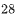 for  in the given function yields 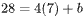, or 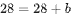. Subtracting  from each side of this equation yields 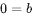. Therefore, the value of <mjx-container alttext="b" aria-label="b" class="MathJax CtxtMenu_Attached_0" ctxtmenu_counter="223" jax="SVG" role="img" style="position: relative;" tabindex="0"><svg aria-hidden="true" focusable="false" height="1.595ex" role="img" style="vertical-align: -0.025ex;" viewbox="0 -694 429 705" width="0.971ex" xmlns="http://www.w3.org/2000/svg" xmlns:xlink="http://www.w3.org/1999/xlink"><defs><path d="M73 647Q73 657 77 670T89 683Q90 683 161 688T234 694Q246 694 246 685T212 542Q204 508 195 472T180 418L176 399Q176 396 182 402Q231 442 283 442Q345 442 383 396T422 280Q422 169 343 79T173 -11Q123 -11 82 27T40 150V159Q40 180 48 217T97 414Q147 611 147 623T109 637Q104 637 101 637H96Q86 637 83 637T76 640T73 647ZM336 325V331Q336 405 275 405Q258 405 240 397T207 376T181 352T163 330L157 322L136 236Q114 150 114 114Q114 66 138 42Q154 26 178 26Q211 26 245 58Q270 81 285 114T318 219Q336 291 336 325Z" id="MJX-224-TEX-I-1D44F"></path></defs><g fill="currentColor" stroke="currentColor" stroke-width="0" transform="scale(1,-1)"><g data-mml-node="math"><g data-mml-node="mi"><use data-c="1D44F" xlink:href="#MJX-224-TEX-I-1D44F"></use></g></g></g></svg><mjx-assistive-mml display="inline" unselectable="on"><math alttext="b" xmlns="http://www.w3.org/1998/Math/MathML"><mi>b</mi></math></mjx-assistive-mml></mjx-container> is <mjx-container alttext="0" aria-label="0" class="MathJax CtxtMenu_Attached_0" ctxtmenu_counter="224" jax="SVG" role="img" style="position: relative;" tabindex="0"><svg aria-hidden="true" focusable="false" height="1.557ex" role="img" style="vertical-align: -0.05ex;" viewbox="0 -666 500 688" width="1.131ex" xmlns="http://www.w3.org/2000/svg" xmlns:xlink="http://www.w3.org/1999/xlink"><defs><path d="M96 585Q152 666 249 666Q297 666 345 640T423 548Q460 465 460 320Q460 165 417 83Q397 41 362 16T301 -15T250 -22Q224 -22 198 -16T137 16T82 83Q39 165 39 320Q39 494 96 585ZM321 597Q291 629 250 629Q208 629 178 597Q153 571 145 525T137 333Q137 175 145 125T181 46Q209 16 250 16Q290 16 318 46Q347 76 354 130T362 333Q362 478 354 524T321 597Z" id="MJX-225-TEX-N-30"></path></defs><g fill="currentColor" stroke="currentColor" stroke-width="0" transform="scale(1,-1)"><g data-mml-node="math"><g data-mml-node="mn"><use data-c="30" xlink:href="#MJX-225-TEX-N-30"></use></g></g></g></svg><mjx-assistive-mml display="inline" unselectable="on"><math alttext="0" xmlns="http://www.w3.org/1998/Math/MathML"><mn>0</mn></math></mjx-assistive-mml></mjx-container>.

Choice B is incorrect. Substituting <mjx-container alttext="1" aria-label="1" class="MathJax CtxtMenu_Attached_0" ctxtmenu_counter="225" jax="SVG" role="img" style="position: relative;" tabindex="0"><svg aria-hidden="true" focusable="false" height="1.507ex" role="img" style="vertical-align: 0px;" viewbox="0 -666 500 666" width="1.131ex" xmlns="http://www.w3.org/2000/svg" xmlns:xlink="http://www.w3.org/1999/xlink"><defs><path d="M213 578L200 573Q186 568 160 563T102 556H83V602H102Q149 604 189 617T245 641T273 663Q275 666 285 666Q294 666 302 660V361L303 61Q310 54 315 52T339 48T401 46H427V0H416Q395 3 257 3Q121 3 100 0H88V46H114Q136 46 152 46T177 47T193 50T201 52T207 57T213 61V578Z" id="MJX-226-TEX-N-31"></path></defs><g fill="currentColor" stroke="currentColor" stroke-width="0" transform="scale(1,-1)"><g data-mml-node="math"><g data-mml-node="mn"><use data-c="31" xlink:href="#MJX-226-TEX-N-31"></use></g></g></g></svg><mjx-assistive-mml display="inline" unselectable="on"><math alttext="1" xmlns="http://www.w3.org/1998/Math/MathML"><mn>1</mn></math></mjx-assistive-mml></mjx-container> for <mjx-container alttext="b" aria-label="b" class="MathJax CtxtMenu_Attached_0" ctxtmenu_counter="226" jax="SVG" role="img" style="position: relative;" tabindex="0"><svg aria-hidden="true" focusable="false" height="1.595ex" role="img" style="vertical-align: -0.025ex;" viewbox="0 -694 429 705" width="0.971ex" xmlns="http://www.w3.org/2000/svg" xmlns:xlink="http://www.w3.org/1999/xlink"><defs><path d="M73 647Q73 657 77 670T89 683Q90 683 161 688T234 694Q246 694 246 685T212 542Q204 508 195 472T180 418L176 399Q176 396 182 402Q231 442 283 442Q345 442 383 396T422 280Q422 169 343 79T173 -11Q123 -11 82 27T40 150V159Q40 180 48 217T97 414Q147 611 147 623T109 637Q104 637 101 637H96Q86 637 83 637T76 640T73 647ZM336 325V331Q336 405 275 405Q258 405 240 397T207 376T181 352T163 330L157 322L136 236Q114 150 114 114Q114 66 138 42Q154 26 178 26Q211 26 245 58Q270 81 285 114T318 219Q336 291 336 325Z" id="MJX-227-TEX-I-1D44F"></path></defs><g fill="currentColor" stroke="currentColor" stroke-width="0" transform="scale(1,-1)"><g data-mml-node="math"><g data-mml-node="mi"><use data-c="1D44F" xlink:href="#MJX-227-TEX-I-1D44F"></use></g></g></g></svg><mjx-assistive-mml display="inline" unselectable="on"><math alttext="b" xmlns="http://www.w3.org/1998/Math/MathML"><mi>b</mi></math></mjx-assistive-mml></mjx-container> in the given function yields 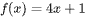. For this function, when the value of <mjx-container alttext="x" aria-label="x" class="MathJax CtxtMenu_Attached_0" ctxtmenu_counter="228" jax="SVG" role="img" style="position: relative;" tabindex="0"><svg aria-hidden="true" focusable="false" height="1.025ex" role="img" style="vertical-align: -0.025ex;" viewbox="0 -442 572 453" width="1.294ex" xmlns="http://www.w3.org/2000/svg" xmlns:xlink="http://www.w3.org/1999/xlink"><defs><path d="M52 289Q59 331 106 386T222 442Q257 442 286 424T329 379Q371 442 430 442Q467 442 494 420T522 361Q522 332 508 314T481 292T458 288Q439 288 427 299T415 328Q415 374 465 391Q454 404 425 404Q412 404 406 402Q368 386 350 336Q290 115 290 78Q290 50 306 38T341 26Q378 26 414 59T463 140Q466 150 469 151T485 153H489Q504 153 504 145Q504 144 502 134Q486 77 440 33T333 -11Q263 -11 227 52Q186 -10 133 -10H127Q78 -10 57 16T35 71Q35 103 54 123T99 143Q142 143 142 101Q142 81 130 66T107 46T94 41L91 40Q91 39 97 36T113 29T132 26Q168 26 194 71Q203 87 217 139T245 247T261 313Q266 340 266 352Q266 380 251 392T217 404Q177 404 142 372T93 290Q91 281 88 280T72 278H58Q52 284 52 289Z" id="MJX-229-TEX-I-1D465"></path></defs><g fill="currentColor" stroke="currentColor" stroke-width="0" transform="scale(1,-1)"><g data-mml-node="math"><g data-mml-node="mi"><use data-c="1D465" xlink:href="#MJX-229-TEX-I-1D465"></use></g></g></g></svg><mjx-assistive-mml display="inline" unselectable="on"><math alttext="x" xmlns="http://www.w3.org/1998/Math/MathML"><mi>x</mi></math></mjx-assistive-mml></mjx-container> is <mjx-container alttext="7" aria-label="7" class="MathJax CtxtMenu_Attached_0" ctxtmenu_counter="229" jax="SVG" role="img" style="position: relative;" tabindex="0"><svg aria-hidden="true" focusable="false" height="1.579ex" role="img" style="vertical-align: -0.05ex;" viewbox="0 -676 500 698" width="1.131ex" xmlns="http://www.w3.org/2000/svg" xmlns:xlink="http://www.w3.org/1999/xlink"><defs><path d="M55 458Q56 460 72 567L88 674Q88 676 108 676H128V672Q128 662 143 655T195 646T364 644H485V605L417 512Q408 500 387 472T360 435T339 403T319 367T305 330T292 284T284 230T278 162T275 80Q275 66 275 52T274 28V19Q270 2 255 -10T221 -22Q210 -22 200 -19T179 0T168 40Q168 198 265 368Q285 400 349 489L395 552H302Q128 552 119 546Q113 543 108 522T98 479L95 458V455H55V458Z" id="MJX-230-TEX-N-37"></path></defs><g fill="currentColor" stroke="currentColor" stroke-width="0" transform="scale(1,-1)"><g data-mml-node="math"><g data-mml-node="mn"><use data-c="37" xlink:href="#MJX-230-TEX-N-37"></use></g></g></g></svg><mjx-assistive-mml display="inline" unselectable="on"><math alttext="7" xmlns="http://www.w3.org/1998/Math/MathML"><mn>7</mn></math></mjx-assistive-mml></mjx-container>, the value of 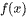 is , not .

Choice C is incorrect. Substituting <mjx-container alttext="4" aria-label="4" class="MathJax CtxtMenu_Attached_0" ctxtmenu_counter="233" jax="SVG" role="img" style="position: relative;" tabindex="0"><svg aria-hidden="true" focusable="false" height="1.532ex" role="img" style="vertical-align: 0px;" viewbox="0 -677 500 677" width="1.131ex" xmlns="http://www.w3.org/2000/svg" xmlns:xlink="http://www.w3.org/1999/xlink"><defs><path d="M462 0Q444 3 333 3Q217 3 199 0H190V46H221Q241 46 248 46T265 48T279 53T286 61Q287 63 287 115V165H28V211L179 442Q332 674 334 675Q336 677 355 677H373L379 671V211H471V165H379V114Q379 73 379 66T385 54Q393 47 442 46H471V0H462ZM293 211V545L74 212L183 211H293Z" id="MJX-234-TEX-N-34"></path></defs><g fill="currentColor" stroke="currentColor" stroke-width="0" transform="scale(1,-1)"><g data-mml-node="math"><g data-mml-node="mn"><use data-c="34" xlink:href="#MJX-234-TEX-N-34"></use></g></g></g></svg><mjx-assistive-mml display="inline" unselectable="on"><math alttext="4" xmlns="http://www.w3.org/1998/Math/MathML"><mn>4</mn></math></mjx-assistive-mml></mjx-container> for <mjx-container alttext="b" aria-label="b" class="MathJax CtxtMenu_Attached_0" ctxtmenu_counter="234" jax="SVG" role="img" style="position: relative;" tabindex="0"><svg aria-hidden="true" focusable="false" height="1.595ex" role="img" style="vertical-align: -0.025ex;" viewbox="0 -694 429 705" width="0.971ex" xmlns="http://www.w3.org/2000/svg" xmlns:xlink="http://www.w3.org/1999/xlink"><defs><path d="M73 647Q73 657 77 670T89 683Q90 683 161 688T234 694Q246 694 246 685T212 542Q204 508 195 472T180 418L176 399Q176 396 182 402Q231 442 283 442Q345 442 383 396T422 280Q422 169 343 79T173 -11Q123 -11 82 27T40 150V159Q40 180 48 217T97 414Q147 611 147 623T109 637Q104 637 101 637H96Q86 637 83 637T76 640T73 647ZM336 325V331Q336 405 275 405Q258 405 240 397T207 376T181 352T163 330L157 322L136 236Q114 150 114 114Q114 66 138 42Q154 26 178 26Q211 26 245 58Q270 81 285 114T318 219Q336 291 336 325Z" id="MJX-235-TEX-I-1D44F"></path></defs><g fill="currentColor" stroke="currentColor" stroke-width="0" transform="scale(1,-1)"><g data-mml-node="math"><g data-mml-node="mi"><use data-c="1D44F" xlink:href="#MJX-235-TEX-I-1D44F"></use></g></g></g></svg><mjx-assistive-mml display="inline" unselectable="on"><math alttext="b" xmlns="http://www.w3.org/1998/Math/MathML"><mi>b</mi></math></mjx-assistive-mml></mjx-container> in the given function yields 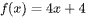. For this function, when the value of <mjx-container alttext="x" aria-label="x" class="MathJax CtxtMenu_Attached_0" ctxtmenu_counter="236" jax="SVG" role="img" style="position: relative;" tabindex="0"><svg aria-hidden="true" focusable="false" height="1.025ex" role="img" style="vertical-align: -0.025ex;" viewbox="0 -442 572 453" width="1.294ex" xmlns="http://www.w3.org/2000/svg" xmlns:xlink="http://www.w3.org/1999/xlink"><defs><path d="M52 289Q59 331 106 386T222 442Q257 442 286 424T329 379Q371 442 430 442Q467 442 494 420T522 361Q522 332 508 314T481 292T458 288Q439 288 427 299T415 328Q415 374 465 391Q454 404 425 404Q412 404 406 402Q368 386 350 336Q290 115 290 78Q290 50 306 38T341 26Q378 26 414 59T463 140Q466 150 469 151T485 153H489Q504 153 504 145Q504 144 502 134Q486 77 440 33T333 -11Q263 -11 227 52Q186 -10 133 -10H127Q78 -10 57 16T35 71Q35 103 54 123T99 143Q142 143 142 101Q142 81 130 66T107 46T94 41L91 40Q91 39 97 36T113 29T132 26Q168 26 194 71Q203 87 217 139T245 247T261 313Q266 340 266 352Q266 380 251 392T217 404Q177 404 142 372T93 290Q91 281 88 280T72 278H58Q52 284 52 289Z" id="MJX-237-TEX-I-1D465"></path></defs><g fill="currentColor" stroke="currentColor" stroke-width="0" transform="scale(1,-1)"><g data-mml-node="math"><g data-mml-node="mi"><use data-c="1D465" xlink:href="#MJX-237-TEX-I-1D465"></use></g></g></g></svg><mjx-assistive-mml display="inline" unselectable="on"><math alttext="x" xmlns="http://www.w3.org/1998/Math/MathML"><mi>x</mi></math></mjx-assistive-mml></mjx-container> is <mjx-container alttext="7" aria-label="7" class="MathJax CtxtMenu_Attached_0" ctxtmenu_counter="237" jax="SVG" role="img" style="position: relative;" tabindex="0"><svg aria-hidden="true" focusable="false" height="1.579ex" role="img" style="vertical-align: -0.05ex;" viewbox="0 -676 500 698" width="1.131ex" xmlns="http://www.w3.org/2000/svg" xmlns:xlink="http://www.w3.org/1999/xlink"><defs><path d="M55 458Q56 460 72 567L88 674Q88 676 108 676H128V672Q128 662 143 655T195 646T364 644H485V605L417 512Q408 500 387 472T360 435T339 403T319 367T305 330T292 284T284 230T278 162T275 80Q275 66 275 52T274 28V19Q270 2 255 -10T221 -22Q210 -22 200 -19T179 0T168 40Q168 198 265 368Q285 400 349 489L395 552H302Q128 552 119 546Q113 543 108 522T98 479L95 458V455H55V458Z" id="MJX-238-TEX-N-37"></path></defs><g fill="currentColor" stroke="currentColor" stroke-width="0" transform="scale(1,-1)"><g data-mml-node="math"><g data-mml-node="mn"><use data-c="37" xlink:href="#MJX-238-TEX-N-37"></use></g></g></g></svg><mjx-assistive-mml display="inline" unselectable="on"><math alttext="7" xmlns="http://www.w3.org/1998/Math/MathML"><mn>7</mn></math></mjx-assistive-mml></mjx-container>, the value of  is 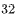, not .

Choice D is incorrect. Substituting <mjx-container alttext="7" aria-label="7" class="MathJax CtxtMenu_Attached_0" ctxtmenu_counter="241" jax="SVG" role="img" style="position: relative;" tabindex="0"><svg aria-hidden="true" focusable="false" height="1.579ex" role="img" style="vertical-align: -0.05ex;" viewbox="0 -676 500 698" width="1.131ex" xmlns="http://www.w3.org/2000/svg" xmlns:xlink="http://www.w3.org/1999/xlink"><defs><path d="M55 458Q56 460 72 567L88 674Q88 676 108 676H128V672Q128 662 143 655T195 646T364 644H485V605L417 512Q408 500 387 472T360 435T339 403T319 367T305 330T292 284T284 230T278 162T275 80Q275 66 275 52T274 28V19Q270 2 255 -10T221 -22Q210 -22 200 -19T179 0T168 40Q168 198 265 368Q285 400 349 489L395 552H302Q128 552 119 546Q113 543 108 522T98 479L95 458V455H55V458Z" id="MJX-242-TEX-N-37"></path></defs><g fill="currentColor" stroke="currentColor" stroke-width="0" transform="scale(1,-1)"><g data-mml-node="math"><g data-mml-node="mn"><use data-c="37" xlink:href="#MJX-242-TEX-N-37"></use></g></g></g></svg><mjx-assistive-mml display="inline" unselectable="on"><math alttext="7" xmlns="http://www.w3.org/1998/Math/MathML"><mn>7</mn></math></mjx-assistive-mml></mjx-container> for <mjx-container alttext="b" aria-label="b" class="MathJax CtxtMenu_Attached_0" ctxtmenu_counter="242" jax="SVG" role="img" style="position: relative;" tabindex="0"><svg aria-hidden="true" focusable="false" height="1.595ex" role="img" style="vertical-align: -0.025ex;" viewbox="0 -694 429 705" width="0.971ex" xmlns="http://www.w3.org/2000/svg" xmlns:xlink="http://www.w3.org/1999/xlink"><defs><path d="M73 647Q73 657 77 670T89 683Q90 683 161 688T234 694Q246 694 246 685T212 542Q204 508 195 472T180 418L176 399Q176 396 182 402Q231 442 283 442Q345 442 383 396T422 280Q422 169 343 79T173 -11Q123 -11 82 27T40 150V159Q40 180 48 217T97 414Q147 611 147 623T109 637Q104 637 101 637H96Q86 637 83 637T76 640T73 647ZM336 325V331Q336 405 275 405Q258 405 240 397T207 376T181 352T163 330L157 322L136 236Q114 150 114 114Q114 66 138 42Q154 26 178 26Q211 26 245 58Q270 81 285 114T318 219Q336 291 336 325Z" id="MJX-243-TEX-I-1D44F"></path></defs><g fill="currentColor" stroke="currentColor" stroke-width="0" transform="scale(1,-1)"><g data-mml-node="math"><g data-mml-node="mi"><use data-c="1D44F" xlink:href="#MJX-243-TEX-I-1D44F"></use></g></g></g></svg><mjx-assistive-mml display="inline" unselectable="on"><math alttext="b" xmlns="http://www.w3.org/1998/Math/MathML"><mi>b</mi></math></mjx-assistive-mml></mjx-container> in the given function yields 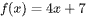. For this function, when the value of <mjx-container alttext="x" aria-label="x" class="MathJax CtxtMenu_Attached_0" ctxtmenu_counter="244" jax="SVG" role="img" style="position: relative;" tabindex="0"><svg aria-hidden="true" focusable="false" height="1.025ex" role="img" style="vertical-align: -0.025ex;" viewbox="0 -442 572 453" width="1.294ex" xmlns="http://www.w3.org/2000/svg" xmlns:xlink="http://www.w3.org/1999/xlink"><defs><path d="M52 289Q59 331 106 386T222 442Q257 442 286 424T329 379Q371 442 430 442Q467 442 494 420T522 361Q522 332 508 314T481 292T458 288Q439 288 427 299T415 328Q415 374 465 391Q454 404 425 404Q412 404 406 402Q368 386 350 336Q290 115 290 78Q290 50 306 38T341 26Q378 26 414 59T463 140Q466 150 469 151T485 153H489Q504 153 504 145Q504 144 502 134Q486 77 440 33T333 -11Q263 -11 227 52Q186 -10 133 -10H127Q78 -10 57 16T35 71Q35 103 54 123T99 143Q142 143 142 101Q142 81 130 66T107 46T94 41L91 40Q91 39 97 36T113 29T132 26Q168 26 194 71Q203 87 217 139T245 247T261 313Q266 340 266 352Q266 380 251 392T217 404Q177 404 142 372T93 290Q91 281 88 280T72 278H58Q52 284 52 289Z" id="MJX-245-TEX-I-1D465"></path></defs><g fill="currentColor" stroke="currentColor" stroke-width="0" transform="scale(1,-1)"><g data-mml-node="math"><g data-mml-node="mi"><use data-c="1D465" xlink:href="#MJX-245-TEX-I-1D465"></use></g></g></g></svg><mjx-assistive-mml display="inline" unselectable="on"><math alttext="x" xmlns="http://www.w3.org/1998/Math/MathML"><mi>x</mi></math></mjx-assistive-mml></mjx-container> is <mjx-container alttext="7" aria-label="7" class="MathJax CtxtMenu_Attached_0" ctxtmenu_counter="245" jax="SVG" role="img" style="position: relative;" tabindex="0"><svg aria-hidden="true" focusable="false" height="1.579ex" role="img" style="vertical-align: -0.05ex;" viewbox="0 -676 500 698" width="1.131ex" xmlns="http://www.w3.org/2000/svg" xmlns:xlink="http://www.w3.org/1999/xlink"><defs><path d="M55 458Q56 460 72 567L88 674Q88 676 108 676H128V672Q128 662 143 655T195 646T364 644H485V605L417 512Q408 500 387 472T360 435T339 403T319 367T305 330T292 284T284 230T278 162T275 80Q275 66 275 52T274 28V19Q270 2 255 -10T221 -22Q210 -22 200 -19T179 0T168 40Q168 198 265 368Q285 400 349 489L395 552H302Q128 552 119 546Q113 543 108 522T98 479L95 458V455H55V458Z" id="MJX-246-TEX-N-37"></path></defs><g fill="currentColor" stroke="currentColor" stroke-width="0" transform="scale(1,-1)"><g data-mml-node="math"><g data-mml-node="mn"><use data-c="37" xlink:href="#MJX-246-TEX-N-37"></use></g></g></g></svg><mjx-assistive-mml display="inline" unselectable="on"><math alttext="7" xmlns="http://www.w3.org/1998/Math/MathML"><mn>7</mn></math></mjx-assistive-mml></mjx-container>, the value of 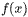 is , not .

