# Question

The function <mjx-container alttext="f" aria-label="f" class="MathJax CtxtMenu_Attached_0" ctxtmenu_counter="93" jax="SVG" role="img" style="position: relative;" tabindex="0"><svg aria-hidden="true" focusable="false" height="2.059ex" role="img" style="vertical-align: -0.464ex;" viewbox="0 -705 550 910" width="1.244ex" xmlns="http://www.w3.org/2000/svg" xmlns:xlink="http://www.w3.org/1999/xlink"><defs><path d="M118 -162Q120 -162 124 -164T135 -167T147 -168Q160 -168 171 -155T187 -126Q197 -99 221 27T267 267T289 382V385H242Q195 385 192 387Q188 390 188 397L195 425Q197 430 203 430T250 431Q298 431 298 432Q298 434 307 482T319 540Q356 705 465 705Q502 703 526 683T550 630Q550 594 529 578T487 561Q443 561 443 603Q443 622 454 636T478 657L487 662Q471 668 457 668Q445 668 434 658T419 630Q412 601 403 552T387 469T380 433Q380 431 435 431Q480 431 487 430T498 424Q499 420 496 407T491 391Q489 386 482 386T428 385H372L349 263Q301 15 282 -47Q255 -132 212 -173Q175 -205 139 -205Q107 -205 81 -186T55 -132Q55 -95 76 -78T118 -61Q162 -61 162 -103Q162 -122 151 -136T127 -157L118 -162Z" id="MJX-94-TEX-I-1D453"></path></defs><g fill="currentColor" stroke="currentColor" stroke-width="0" transform="scale(1,-1)"><g data-mml-node="math"><g data-mml-node="mi"><use data-c="1D453" xlink:href="#MJX-94-TEX-I-1D453"></use></g></g></g></svg><mjx-assistive-mml display="inline" unselectable="on"><math alttext="f" xmlns="http://www.w3.org/1998/Math/MathML"><mi>f</mi></math></mjx-assistive-mml></mjx-container> is defined by 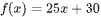. What is the value of  when 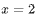?

# Choices
* **A** 

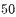

* **B** 

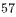

* **C** 

* **D** 

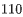

# Answer

# Rationale
<h5 class="cb-margin-bottom-16 cb-font-weight-bold">Rationale</h5>
Correct Answer: C

Choice C is correct. It’s given that the function <mjx-container alttext="f" aria-label="f" class="MathJax CtxtMenu_Attached_0" ctxtmenu_counter="101" jax="SVG" role="img" style="position: relative;" tabindex="0"><svg aria-hidden="true" focusable="false" height="2.059ex" role="img" style="vertical-align: -0.464ex;" viewbox="0 -705 550 910" width="1.244ex" xmlns="http://www.w3.org/2000/svg" xmlns:xlink="http://www.w3.org/1999/xlink"><defs><path d="M118 -162Q120 -162 124 -164T135 -167T147 -168Q160 -168 171 -155T187 -126Q197 -99 221 27T267 267T289 382V385H242Q195 385 192 387Q188 390 188 397L195 425Q197 430 203 430T250 431Q298 431 298 432Q298 434 307 482T319 540Q356 705 465 705Q502 703 526 683T550 630Q550 594 529 578T487 561Q443 561 443 603Q443 622 454 636T478 657L487 662Q471 668 457 668Q445 668 434 658T419 630Q412 601 403 552T387 469T380 433Q380 431 435 431Q480 431 487 430T498 424Q499 420 496 407T491 391Q489 386 482 386T428 385H372L349 263Q301 15 282 -47Q255 -132 212 -173Q175 -205 139 -205Q107 -205 81 -186T55 -132Q55 -95 76 -78T118 -61Q162 -61 162 -103Q162 -122 151 -136T127 -157L118 -162Z" id="MJX-102-TEX-I-1D453"></path></defs><g fill="currentColor" stroke="currentColor" stroke-width="0" transform="scale(1,-1)"><g data-mml-node="math"><g data-mml-node="mi"><use data-c="1D453" xlink:href="#MJX-102-TEX-I-1D453"></use></g></g></g></svg><mjx-assistive-mml display="inline" unselectable="on"><math alttext="f" xmlns="http://www.w3.org/1998/Math/MathML"><mi>f</mi></math></mjx-assistive-mml></mjx-container> is defined by . Substituting <mjx-container alttext="2" aria-label="2" class="MathJax CtxtMenu_Attached_0" ctxtmenu_counter="103" jax="SVG" role="img" style="position: relative;" tabindex="0"><svg aria-hidden="true" focusable="false" height="1.507ex" role="img" style="vertical-align: 0px;" viewbox="0 -666 500 666" width="1.131ex" xmlns="http://www.w3.org/2000/svg" xmlns:xlink="http://www.w3.org/1999/xlink"><defs><path d="M109 429Q82 429 66 447T50 491Q50 562 103 614T235 666Q326 666 387 610T449 465Q449 422 429 383T381 315T301 241Q265 210 201 149L142 93L218 92Q375 92 385 97Q392 99 409 186V189H449V186Q448 183 436 95T421 3V0H50V19V31Q50 38 56 46T86 81Q115 113 136 137Q145 147 170 174T204 211T233 244T261 278T284 308T305 340T320 369T333 401T340 431T343 464Q343 527 309 573T212 619Q179 619 154 602T119 569T109 550Q109 549 114 549Q132 549 151 535T170 489Q170 464 154 447T109 429Z" id="MJX-104-TEX-N-32"></path></defs><g fill="currentColor" stroke="currentColor" stroke-width="0" transform="scale(1,-1)"><g data-mml-node="math"><g data-mml-node="mn"><use data-c="32" xlink:href="#MJX-104-TEX-N-32"></use></g></g></g></svg><mjx-assistive-mml display="inline" unselectable="on"><math alttext="2" xmlns="http://www.w3.org/1998/Math/MathML"><mn>2</mn></math></mjx-assistive-mml></mjx-container> for <mjx-container alttext="x" aria-label="x" class="MathJax CtxtMenu_Attached_0" ctxtmenu_counter="104" jax="SVG" role="img" style="position: relative;" tabindex="0"><svg aria-hidden="true" focusable="false" height="1.025ex" role="img" style="vertical-align: -0.025ex;" viewbox="0 -442 572 453" width="1.294ex" xmlns="http://www.w3.org/2000/svg" xmlns:xlink="http://www.w3.org/1999/xlink"><defs><path d="M52 289Q59 331 106 386T222 442Q257 442 286 424T329 379Q371 442 430 442Q467 442 494 420T522 361Q522 332 508 314T481 292T458 288Q439 288 427 299T415 328Q415 374 465 391Q454 404 425 404Q412 404 406 402Q368 386 350 336Q290 115 290 78Q290 50 306 38T341 26Q378 26 414 59T463 140Q466 150 469 151T485 153H489Q504 153 504 145Q504 144 502 134Q486 77 440 33T333 -11Q263 -11 227 52Q186 -10 133 -10H127Q78 -10 57 16T35 71Q35 103 54 123T99 143Q142 143 142 101Q142 81 130 66T107 46T94 41L91 40Q91 39 97 36T113 29T132 26Q168 26 194 71Q203 87 217 139T245 247T261 313Q266 340 266 352Q266 380 251 392T217 404Q177 404 142 372T93 290Q91 281 88 280T72 278H58Q52 284 52 289Z" id="MJX-105-TEX-I-1D465"></path></defs><g fill="currentColor" stroke="currentColor" stroke-width="0" transform="scale(1,-1)"><g data-mml-node="math"><g data-mml-node="mi"><use data-c="1D465" xlink:href="#MJX-105-TEX-I-1D465"></use></g></g></g></svg><mjx-assistive-mml display="inline" unselectable="on"><math alttext="x" xmlns="http://www.w3.org/1998/Math/MathML"><mi>x</mi></math></mjx-assistive-mml></mjx-container> in this equation yields 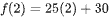, which is equivalent to 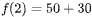, or 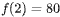. Therefore, the value of  is 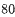 when 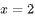.

Choice A is incorrect. This is the value of 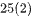, not 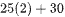.

Choice B is incorrect. This is the value of 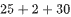, not 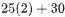.

Choice D is incorrect. This is the value of 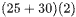, not .

