# Question

The function <mjx-container alttext="f" aria-label="f" class="MathJax CtxtMenu_Attached_0" ctxtmenu_counter="179" jax="SVG" role="img" style="position: relative;" tabindex="0"><svg aria-hidden="true" focusable="false" height="2.059ex" role="img" style="vertical-align: -0.464ex;" viewbox="0 -705 550 910" width="1.244ex" xmlns="http://www.w3.org/2000/svg" xmlns:xlink="http://www.w3.org/1999/xlink"><defs><path d="M118 -162Q120 -162 124 -164T135 -167T147 -168Q160 -168 171 -155T187 -126Q197 -99 221 27T267 267T289 382V385H242Q195 385 192 387Q188 390 188 397L195 425Q197 430 203 430T250 431Q298 431 298 432Q298 434 307 482T319 540Q356 705 465 705Q502 703 526 683T550 630Q550 594 529 578T487 561Q443 561 443 603Q443 622 454 636T478 657L487 662Q471 668 457 668Q445 668 434 658T419 630Q412 601 403 552T387 469T380 433Q380 431 435 431Q480 431 487 430T498 424Q499 420 496 407T491 391Q489 386 482 386T428 385H372L349 263Q301 15 282 -47Q255 -132 212 -173Q175 -205 139 -205Q107 -205 81 -186T55 -132Q55 -95 76 -78T118 -61Q162 -61 162 -103Q162 -122 151 -136T127 -157L118 -162Z" id="MJX-180-TEX-I-1D453"></path></defs><g fill="currentColor" stroke="currentColor" stroke-width="0" transform="scale(1,-1)"><g data-mml-node="math"><g data-mml-node="mi"><use data-c="1D453" xlink:href="#MJX-180-TEX-I-1D453"></use></g></g></g></svg><mjx-assistive-mml display="inline" unselectable="on"><math alttext="f" xmlns="http://www.w3.org/1998/Math/MathML"><mi>f</mi></math></mjx-assistive-mml></mjx-container> is defined by 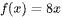. For what value of <mjx-container alttext="x" aria-label="x" class="MathJax CtxtMenu_Attached_0" ctxtmenu_counter="181" jax="SVG" role="img" style="position: relative;" tabindex="0"><svg aria-hidden="true" focusable="false" height="1.025ex" role="img" style="vertical-align: -0.025ex;" viewbox="0 -442 572 453" width="1.294ex" xmlns="http://www.w3.org/2000/svg" xmlns:xlink="http://www.w3.org/1999/xlink"><defs><path d="M52 289Q59 331 106 386T222 442Q257 442 286 424T329 379Q371 442 430 442Q467 442 494 420T522 361Q522 332 508 314T481 292T458 288Q439 288 427 299T415 328Q415 374 465 391Q454 404 425 404Q412 404 406 402Q368 386 350 336Q290 115 290 78Q290 50 306 38T341 26Q378 26 414 59T463 140Q466 150 469 151T485 153H489Q504 153 504 145Q504 144 502 134Q486 77 440 33T333 -11Q263 -11 227 52Q186 -10 133 -10H127Q78 -10 57 16T35 71Q35 103 54 123T99 143Q142 143 142 101Q142 81 130 66T107 46T94 41L91 40Q91 39 97 36T113 29T132 26Q168 26 194 71Q203 87 217 139T245 247T261 313Q266 340 266 352Q266 380 251 392T217 404Q177 404 142 372T93 290Q91 281 88 280T72 278H58Q52 284 52 289Z" id="MJX-182-TEX-I-1D465"></path></defs><g fill="currentColor" stroke="currentColor" stroke-width="0" transform="scale(1,-1)"><g data-mml-node="math"><g data-mml-node="mi"><use data-c="1D465" xlink:href="#MJX-182-TEX-I-1D465"></use></g></g></g></svg><mjx-assistive-mml display="inline" unselectable="on"><math alttext="x" xmlns="http://www.w3.org/1998/Math/MathML"><mi>x</mi></math></mjx-assistive-mml></mjx-container> does ?

# Choices
* **A** 

<mjx-container alttext="8" aria-label="8" class="MathJax CtxtMenu_Attached_0" ctxtmenu_counter="183" jax="SVG" role="img" style="position: relative;" tabindex="0"><svg aria-hidden="true" focusable="false" height="1.557ex" role="img" style="vertical-align: -0.05ex;" viewbox="0 -666 500 688" width="1.131ex" xmlns="http://www.w3.org/2000/svg" xmlns:xlink="http://www.w3.org/1999/xlink"><defs><path d="M70 417T70 494T124 618T248 666Q319 666 374 624T429 515Q429 485 418 459T392 417T361 389T335 371T324 363L338 354Q352 344 366 334T382 323Q457 264 457 174Q457 95 399 37T249 -22Q159 -22 101 29T43 155Q43 263 172 335L154 348Q133 361 127 368Q70 417 70 494ZM286 386L292 390Q298 394 301 396T311 403T323 413T334 425T345 438T355 454T364 471T369 491T371 513Q371 556 342 586T275 624Q268 625 242 625Q201 625 165 599T128 534Q128 511 141 492T167 463T217 431Q224 426 228 424L286 386ZM250 21Q308 21 350 55T392 137Q392 154 387 169T375 194T353 216T330 234T301 253T274 270Q260 279 244 289T218 306L210 311Q204 311 181 294T133 239T107 157Q107 98 150 60T250 21Z" id="MJX-184-TEX-N-38"></path></defs><g fill="currentColor" stroke="currentColor" stroke-width="0" transform="scale(1,-1)"><g data-mml-node="math"><g data-mml-node="mn"><use data-c="38" xlink:href="#MJX-184-TEX-N-38"></use></g></g></g></svg><mjx-assistive-mml display="inline" unselectable="on"><math alttext="8" xmlns="http://www.w3.org/1998/Math/MathML"><mn>8</mn></math></mjx-assistive-mml></mjx-container>

* **B** 

<mjx-container alttext="9" aria-label="9" class="MathJax CtxtMenu_Attached_0" ctxtmenu_counter="184" jax="SVG" role="img" style="position: relative;" tabindex="0"><svg aria-hidden="true" focusable="false" height="1.557ex" role="img" style="vertical-align: -0.05ex;" viewbox="0 -666 500 688" width="1.131ex" xmlns="http://www.w3.org/2000/svg" xmlns:xlink="http://www.w3.org/1999/xlink"><defs><path d="M352 287Q304 211 232 211Q154 211 104 270T44 396Q42 412 42 436V444Q42 537 111 606Q171 666 243 666Q245 666 249 666T257 665H261Q273 665 286 663T323 651T370 619T413 560Q456 472 456 334Q456 194 396 97Q361 41 312 10T208 -22Q147 -22 108 7T68 93T121 149Q143 149 158 135T173 96Q173 78 164 65T148 49T135 44L131 43Q131 41 138 37T164 27T206 22H212Q272 22 313 86Q352 142 352 280V287ZM244 248Q292 248 321 297T351 430Q351 508 343 542Q341 552 337 562T323 588T293 615T246 625Q208 625 181 598Q160 576 154 546T147 441Q147 358 152 329T172 282Q197 248 244 248Z" id="MJX-185-TEX-N-39"></path></defs><g fill="currentColor" stroke="currentColor" stroke-width="0" transform="scale(1,-1)"><g data-mml-node="math"><g data-mml-node="mn"><use data-c="39" xlink:href="#MJX-185-TEX-N-39"></use></g></g></g></svg><mjx-assistive-mml display="inline" unselectable="on"><math alttext="9" xmlns="http://www.w3.org/1998/Math/MathML"><mn>9</mn></math></mjx-assistive-mml></mjx-container>

* **C** 

* **D** 

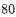

# Answer

# Rationale
<h5 class="cb-margin-bottom-16 cb-font-weight-bold">Rationale</h5>
Correct Answer: B

Choice B is correct. Substituting 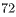 for  in the given function yields 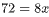. Dividing each side of this equation by <mjx-container alttext="8" aria-label="8" class="MathJax CtxtMenu_Attached_0" ctxtmenu_counter="190" jax="SVG" role="img" style="position: relative;" tabindex="0"><svg aria-hidden="true" focusable="false" height="1.557ex" role="img" style="vertical-align: -0.05ex;" viewbox="0 -666 500 688" width="1.131ex" xmlns="http://www.w3.org/2000/svg" xmlns:xlink="http://www.w3.org/1999/xlink"><defs><path d="M70 417T70 494T124 618T248 666Q319 666 374 624T429 515Q429 485 418 459T392 417T361 389T335 371T324 363L338 354Q352 344 366 334T382 323Q457 264 457 174Q457 95 399 37T249 -22Q159 -22 101 29T43 155Q43 263 172 335L154 348Q133 361 127 368Q70 417 70 494ZM286 386L292 390Q298 394 301 396T311 403T323 413T334 425T345 438T355 454T364 471T369 491T371 513Q371 556 342 586T275 624Q268 625 242 625Q201 625 165 599T128 534Q128 511 141 492T167 463T217 431Q224 426 228 424L286 386ZM250 21Q308 21 350 55T392 137Q392 154 387 169T375 194T353 216T330 234T301 253T274 270Q260 279 244 289T218 306L210 311Q204 311 181 294T133 239T107 157Q107 98 150 60T250 21Z" id="MJX-191-TEX-N-38"></path></defs><g fill="currentColor" stroke="currentColor" stroke-width="0" transform="scale(1,-1)"><g data-mml-node="math"><g data-mml-node="mn"><use data-c="38" xlink:href="#MJX-191-TEX-N-38"></use></g></g></g></svg><mjx-assistive-mml display="inline" unselectable="on"><math alttext="8" xmlns="http://www.w3.org/1998/Math/MathML"><mn>8</mn></math></mjx-assistive-mml></mjx-container> yields 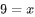. Therefore, 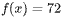 when the value of <mjx-container alttext="x" aria-label="x" class="MathJax CtxtMenu_Attached_0" ctxtmenu_counter="193" jax="SVG" role="img" style="position: relative;" tabindex="0"><svg aria-hidden="true" focusable="false" height="1.025ex" role="img" style="vertical-align: -0.025ex;" viewbox="0 -442 572 453" width="1.294ex" xmlns="http://www.w3.org/2000/svg" xmlns:xlink="http://www.w3.org/1999/xlink"><defs><path d="M52 289Q59 331 106 386T222 442Q257 442 286 424T329 379Q371 442 430 442Q467 442 494 420T522 361Q522 332 508 314T481 292T458 288Q439 288 427 299T415 328Q415 374 465 391Q454 404 425 404Q412 404 406 402Q368 386 350 336Q290 115 290 78Q290 50 306 38T341 26Q378 26 414 59T463 140Q466 150 469 151T485 153H489Q504 153 504 145Q504 144 502 134Q486 77 440 33T333 -11Q263 -11 227 52Q186 -10 133 -10H127Q78 -10 57 16T35 71Q35 103 54 123T99 143Q142 143 142 101Q142 81 130 66T107 46T94 41L91 40Q91 39 97 36T113 29T132 26Q168 26 194 71Q203 87 217 139T245 247T261 313Q266 340 266 352Q266 380 251 392T217 404Q177 404 142 372T93 290Q91 281 88 280T72 278H58Q52 284 52 289Z" id="MJX-194-TEX-I-1D465"></path></defs><g fill="currentColor" stroke="currentColor" stroke-width="0" transform="scale(1,-1)"><g data-mml-node="math"><g data-mml-node="mi"><use data-c="1D465" xlink:href="#MJX-194-TEX-I-1D465"></use></g></g></g></svg><mjx-assistive-mml display="inline" unselectable="on"><math alttext="x" xmlns="http://www.w3.org/1998/Math/MathML"><mi>x</mi></math></mjx-assistive-mml></mjx-container> is <mjx-container alttext="9" aria-label="9" class="MathJax CtxtMenu_Attached_0" ctxtmenu_counter="194" jax="SVG" role="img" style="position: relative;" tabindex="0"><svg aria-hidden="true" focusable="false" height="1.557ex" role="img" style="vertical-align: -0.05ex;" viewbox="0 -666 500 688" width="1.131ex" xmlns="http://www.w3.org/2000/svg" xmlns:xlink="http://www.w3.org/1999/xlink"><defs><path d="M352 287Q304 211 232 211Q154 211 104 270T44 396Q42 412 42 436V444Q42 537 111 606Q171 666 243 666Q245 666 249 666T257 665H261Q273 665 286 663T323 651T370 619T413 560Q456 472 456 334Q456 194 396 97Q361 41 312 10T208 -22Q147 -22 108 7T68 93T121 149Q143 149 158 135T173 96Q173 78 164 65T148 49T135 44L131 43Q131 41 138 37T164 27T206 22H212Q272 22 313 86Q352 142 352 280V287ZM244 248Q292 248 321 297T351 430Q351 508 343 542Q341 552 337 562T323 588T293 615T246 625Q208 625 181 598Q160 576 154 546T147 441Q147 358 152 329T172 282Q197 248 244 248Z" id="MJX-195-TEX-N-39"></path></defs><g fill="currentColor" stroke="currentColor" stroke-width="0" transform="scale(1,-1)"><g data-mml-node="math"><g data-mml-node="mn"><use data-c="39" xlink:href="#MJX-195-TEX-N-39"></use></g></g></g></svg><mjx-assistive-mml display="inline" unselectable="on"><math alttext="9" xmlns="http://www.w3.org/1998/Math/MathML"><mn>9</mn></math></mjx-assistive-mml></mjx-container>.

Choice A is incorrect. This is the value of <mjx-container alttext="x" aria-label="x" class="MathJax CtxtMenu_Attached_0" ctxtmenu_counter="195" jax="SVG" role="img" style="position: relative;" tabindex="0"><svg aria-hidden="true" focusable="false" height="1.025ex" role="img" style="vertical-align: -0.025ex;" viewbox="0 -442 572 453" width="1.294ex" xmlns="http://www.w3.org/2000/svg" xmlns:xlink="http://www.w3.org/1999/xlink"><defs><path d="M52 289Q59 331 106 386T222 442Q257 442 286 424T329 379Q371 442 430 442Q467 442 494 420T522 361Q522 332 508 314T481 292T458 288Q439 288 427 299T415 328Q415 374 465 391Q454 404 425 404Q412 404 406 402Q368 386 350 336Q290 115 290 78Q290 50 306 38T341 26Q378 26 414 59T463 140Q466 150 469 151T485 153H489Q504 153 504 145Q504 144 502 134Q486 77 440 33T333 -11Q263 -11 227 52Q186 -10 133 -10H127Q78 -10 57 16T35 71Q35 103 54 123T99 143Q142 143 142 101Q142 81 130 66T107 46T94 41L91 40Q91 39 97 36T113 29T132 26Q168 26 194 71Q203 87 217 139T245 247T261 313Q266 340 266 352Q266 380 251 392T217 404Q177 404 142 372T93 290Q91 281 88 280T72 278H58Q52 284 52 289Z" id="MJX-196-TEX-I-1D465"></path></defs><g fill="currentColor" stroke="currentColor" stroke-width="0" transform="scale(1,-1)"><g data-mml-node="math"><g data-mml-node="mi"><use data-c="1D465" xlink:href="#MJX-196-TEX-I-1D465"></use></g></g></g></svg><mjx-assistive-mml display="inline" unselectable="on"><math alttext="x" xmlns="http://www.w3.org/1998/Math/MathML"><mi>x</mi></math></mjx-assistive-mml></mjx-container> for which 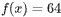, not 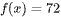.

Choice C is incorrect. This is the value of <mjx-container alttext="x" aria-label="x" class="MathJax CtxtMenu_Attached_0" ctxtmenu_counter="198" jax="SVG" role="img" style="position: relative;" tabindex="0"><svg aria-hidden="true" focusable="false" height="1.025ex" role="img" style="vertical-align: -0.025ex;" viewbox="0 -442 572 453" width="1.294ex" xmlns="http://www.w3.org/2000/svg" xmlns:xlink="http://www.w3.org/1999/xlink"><defs><path d="M52 289Q59 331 106 386T222 442Q257 442 286 424T329 379Q371 442 430 442Q467 442 494 420T522 361Q522 332 508 314T481 292T458 288Q439 288 427 299T415 328Q415 374 465 391Q454 404 425 404Q412 404 406 402Q368 386 350 336Q290 115 290 78Q290 50 306 38T341 26Q378 26 414 59T463 140Q466 150 469 151T485 153H489Q504 153 504 145Q504 144 502 134Q486 77 440 33T333 -11Q263 -11 227 52Q186 -10 133 -10H127Q78 -10 57 16T35 71Q35 103 54 123T99 143Q142 143 142 101Q142 81 130 66T107 46T94 41L91 40Q91 39 97 36T113 29T132 26Q168 26 194 71Q203 87 217 139T245 247T261 313Q266 340 266 352Q266 380 251 392T217 404Q177 404 142 372T93 290Q91 281 88 280T72 278H58Q52 284 52 289Z" id="MJX-199-TEX-I-1D465"></path></defs><g fill="currentColor" stroke="currentColor" stroke-width="0" transform="scale(1,-1)"><g data-mml-node="math"><g data-mml-node="mi"><use data-c="1D465" xlink:href="#MJX-199-TEX-I-1D465"></use></g></g></g></svg><mjx-assistive-mml display="inline" unselectable="on"><math alttext="x" xmlns="http://www.w3.org/1998/Math/MathML"><mi>x</mi></math></mjx-assistive-mml></mjx-container> for which 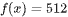, not .

Choice D is incorrect. This is the value of <mjx-container alttext="x" aria-label="x" class="MathJax CtxtMenu_Attached_0" ctxtmenu_counter="201" jax="SVG" role="img" style="position: relative;" tabindex="0"><svg aria-hidden="true" focusable="false" height="1.025ex" role="img" style="vertical-align: -0.025ex;" viewbox="0 -442 572 453" width="1.294ex" xmlns="http://www.w3.org/2000/svg" xmlns:xlink="http://www.w3.org/1999/xlink"><defs><path d="M52 289Q59 331 106 386T222 442Q257 442 286 424T329 379Q371 442 430 442Q467 442 494 420T522 361Q522 332 508 314T481 292T458 288Q439 288 427 299T415 328Q415 374 465 391Q454 404 425 404Q412 404 406 402Q368 386 350 336Q290 115 290 78Q290 50 306 38T341 26Q378 26 414 59T463 140Q466 150 469 151T485 153H489Q504 153 504 145Q504 144 502 134Q486 77 440 33T333 -11Q263 -11 227 52Q186 -10 133 -10H127Q78 -10 57 16T35 71Q35 103 54 123T99 143Q142 143 142 101Q142 81 130 66T107 46T94 41L91 40Q91 39 97 36T113 29T132 26Q168 26 194 71Q203 87 217 139T245 247T261 313Q266 340 266 352Q266 380 251 392T217 404Q177 404 142 372T93 290Q91 281 88 280T72 278H58Q52 284 52 289Z" id="MJX-202-TEX-I-1D465"></path></defs><g fill="currentColor" stroke="currentColor" stroke-width="0" transform="scale(1,-1)"><g data-mml-node="math"><g data-mml-node="mi"><use data-c="1D465" xlink:href="#MJX-202-TEX-I-1D465"></use></g></g></g></svg><mjx-assistive-mml display="inline" unselectable="on"><math alttext="x" xmlns="http://www.w3.org/1998/Math/MathML"><mi>x</mi></math></mjx-assistive-mml></mjx-container> for which 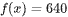, not 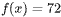.

