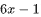
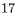
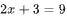
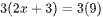
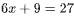
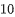
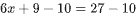
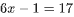
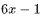
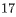

# Question

If , what is the value of ?

# Choices

# Answer

# Rationale
<h5 class="cb-margin-bottom-16 cb-font-weight-bold">Rationale</h5>
Correct Answer: 17

The correct answer is . It’s given that . Multiplying each side of this equation by <mjx-container alttext="3" aria-label="3" class="MathJax CtxtMenu_Attached_0" ctxtmenu_counter="171" jax="SVG" role="img" style="position: relative;" tabindex="0"><svg aria-hidden="true" focusable="false" height="1.554ex" role="img" style="vertical-align: -0.05ex;" viewbox="0 -665 500 687" width="1.131ex" xmlns="http://www.w3.org/2000/svg" xmlns:xlink="http://www.w3.org/1999/xlink"><defs><path d="M127 463Q100 463 85 480T69 524Q69 579 117 622T233 665Q268 665 277 664Q351 652 390 611T430 522Q430 470 396 421T302 350L299 348Q299 347 308 345T337 336T375 315Q457 262 457 175Q457 96 395 37T238 -22Q158 -22 100 21T42 130Q42 158 60 175T105 193Q133 193 151 175T169 130Q169 119 166 110T159 94T148 82T136 74T126 70T118 67L114 66Q165 21 238 21Q293 21 321 74Q338 107 338 175V195Q338 290 274 322Q259 328 213 329L171 330L168 332Q166 335 166 348Q166 366 174 366Q202 366 232 371Q266 376 294 413T322 525V533Q322 590 287 612Q265 626 240 626Q208 626 181 615T143 592T132 580H135Q138 579 143 578T153 573T165 566T175 555T183 540T186 520Q186 498 172 481T127 463Z" id="MJX-172-TEX-N-33"></path></defs><g fill="currentColor" stroke="currentColor" stroke-width="0" transform="scale(1,-1)"><g data-mml-node="math"><g data-mml-node="mn"><use data-c="33" xlink:href="#MJX-172-TEX-N-33"></use></g></g></g></svg><mjx-assistive-mml display="inline" unselectable="on"><math alttext="3" xmlns="http://www.w3.org/1998/Math/MathML"><mn>3</mn></math></mjx-assistive-mml></mjx-container> yields , or . Subtracting  from each side of this equation yields , or . Therefore, the value of  is .

