# Question

<figure class="table"><figure class="table"><figure class="table"><figure class="table"><table border="1">
<tbody>
<tr>
<th scope="col" style="width: 47.7376%; text-align: center;"><mjx-container alttext="x" aria-label="x" class="MathJax CtxtMenu_Attached_0" ctxtmenu_counter="249" jax="SVG" role="img" style="position: relative;" tabindex="0"><svg aria-hidden="true" focusable="false" height="1.025ex" role="img" style="vertical-align: -0.025ex;" viewbox="0 -442 572 453" width="1.294ex" xmlns="http://www.w3.org/2000/svg" xmlns:xlink="http://www.w3.org/1999/xlink"><defs><path d="M52 289Q59 331 106 386T222 442Q257 442 286 424T329 379Q371 442 430 442Q467 442 494 420T522 361Q522 332 508 314T481 292T458 288Q439 288 427 299T415 328Q415 374 465 391Q454 404 425 404Q412 404 406 402Q368 386 350 336Q290 115 290 78Q290 50 306 38T341 26Q378 26 414 59T463 140Q466 150 469 151T485 153H489Q504 153 504 145Q504 144 502 134Q486 77 440 33T333 -11Q263 -11 227 52Q186 -10 133 -10H127Q78 -10 57 16T35 71Q35 103 54 123T99 143Q142 143 142 101Q142 81 130 66T107 46T94 41L91 40Q91 39 97 36T113 29T132 26Q168 26 194 71Q203 87 217 139T245 247T261 313Q266 340 266 352Q266 380 251 392T217 404Q177 404 142 372T93 290Q91 281 88 280T72 278H58Q52 284 52 289Z" id="MJX-250-TEX-I-1D465"></path></defs><g fill="currentColor" stroke="currentColor" stroke-width="0" transform="scale(1,-1)"><g data-mml-node="math"><g data-mml-node="mi"><use data-c="1D465" xlink:href="#MJX-250-TEX-I-1D465"></use></g></g></g></svg><mjx-assistive-mml display="inline" unselectable="on"><math alttext="x" xmlns="http://www.w3.org/1998/Math/MathML"><mi>x</mi></math></mjx-assistive-mml></mjx-container></th>
<th scope="col" style="width: 47.7376%; text-align: center;"><mjx-container alttext="y" aria-label="y" class="MathJax CtxtMenu_Attached_0" ctxtmenu_counter="250" jax="SVG" role="img" style="position: relative;" tabindex="0"><svg aria-hidden="true" focusable="false" height="1.464ex" role="img" style="vertical-align: -0.464ex;" viewbox="0 -442 490 647" width="1.109ex" xmlns="http://www.w3.org/2000/svg" xmlns:xlink="http://www.w3.org/1999/xlink"><defs><path d="M21 287Q21 301 36 335T84 406T158 442Q199 442 224 419T250 355Q248 336 247 334Q247 331 231 288T198 191T182 105Q182 62 196 45T238 27Q261 27 281 38T312 61T339 94Q339 95 344 114T358 173T377 247Q415 397 419 404Q432 431 462 431Q475 431 483 424T494 412T496 403Q496 390 447 193T391 -23Q363 -106 294 -155T156 -205Q111 -205 77 -183T43 -117Q43 -95 50 -80T69 -58T89 -48T106 -45Q150 -45 150 -87Q150 -107 138 -122T115 -142T102 -147L99 -148Q101 -153 118 -160T152 -167H160Q177 -167 186 -165Q219 -156 247 -127T290 -65T313 -9T321 21L315 17Q309 13 296 6T270 -6Q250 -11 231 -11Q185 -11 150 11T104 82Q103 89 103 113Q103 170 138 262T173 379Q173 380 173 381Q173 390 173 393T169 400T158 404H154Q131 404 112 385T82 344T65 302T57 280Q55 278 41 278H27Q21 284 21 287Z" id="MJX-251-TEX-I-1D466"></path></defs><g fill="currentColor" stroke="currentColor" stroke-width="0" transform="scale(1,-1)"><g data-mml-node="math"><g data-mml-node="mi"><use data-c="1D466" xlink:href="#MJX-251-TEX-I-1D466"></use></g></g></g></svg><mjx-assistive-mml display="inline" unselectable="on"><math alttext="y" xmlns="http://www.w3.org/1998/Math/MathML"><mi>y</mi></math></mjx-assistive-mml></mjx-container></th>
</tr>
<tr>
<td style="width: 47.7376%; text-align: center;"><mjx-container alttext="k" aria-label="k" class="MathJax CtxtMenu_Attached_0" ctxtmenu_counter="251" jax="SVG" role="img" style="position: relative;" tabindex="0"><svg aria-hidden="true" focusable="false" height="1.595ex" role="img" style="vertical-align: -0.025ex;" viewbox="0 -694 521 705" width="1.179ex" xmlns="http://www.w3.org/2000/svg" xmlns:xlink="http://www.w3.org/1999/xlink"><defs><path d="M121 647Q121 657 125 670T137 683Q138 683 209 688T282 694Q294 694 294 686Q294 679 244 477Q194 279 194 272Q213 282 223 291Q247 309 292 354T362 415Q402 442 438 442Q468 442 485 423T503 369Q503 344 496 327T477 302T456 291T438 288Q418 288 406 299T394 328Q394 353 410 369T442 390L458 393Q446 405 434 405H430Q398 402 367 380T294 316T228 255Q230 254 243 252T267 246T293 238T320 224T342 206T359 180T365 147Q365 130 360 106T354 66Q354 26 381 26Q429 26 459 145Q461 153 479 153H483Q499 153 499 144Q499 139 496 130Q455 -11 378 -11Q333 -11 305 15T277 90Q277 108 280 121T283 145Q283 167 269 183T234 206T200 217T182 220H180Q168 178 159 139T145 81T136 44T129 20T122 7T111 -2Q98 -11 83 -11Q66 -11 57 -1T48 16Q48 26 85 176T158 471L195 616Q196 629 188 632T149 637H144Q134 637 131 637T124 640T121 647Z" id="MJX-252-TEX-I-1D458"></path></defs><g fill="currentColor" stroke="currentColor" stroke-width="0" transform="scale(1,-1)"><g data-mml-node="math"><g data-mml-node="mi"><use data-c="1D458" xlink:href="#MJX-252-TEX-I-1D458"></use></g></g></g></svg><mjx-assistive-mml display="inline" unselectable="on"><math alttext="k" xmlns="http://www.w3.org/1998/Math/MathML"><mi>k</mi></math></mjx-assistive-mml></mjx-container></td>
<td style="width: 47.7376%; text-align: center;">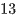</td>
</tr>
<tr>
<td style="width: 47.7376%; text-align: center;">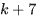</td>
<td style="width: 47.7376%; text-align: center;">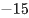</td>
</tr>
</tbody>
</table></figure></figure></figure></figure>

The table gives the coordinates of two points on a line in the <em>xy</em>-plane. The <em>y</em>-intercept of the line is 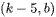, where <mjx-container alttext="k" aria-label="k" class="MathJax CtxtMenu_Attached_0" ctxtmenu_counter="256" jax="SVG" role="img" style="position: relative;" tabindex="0"><svg aria-hidden="true" focusable="false" height="1.595ex" role="img" style="vertical-align: -0.025ex;" viewbox="0 -694 521 705" width="1.179ex" xmlns="http://www.w3.org/2000/svg" xmlns:xlink="http://www.w3.org/1999/xlink"><defs><path d="M121 647Q121 657 125 670T137 683Q138 683 209 688T282 694Q294 694 294 686Q294 679 244 477Q194 279 194 272Q213 282 223 291Q247 309 292 354T362 415Q402 442 438 442Q468 442 485 423T503 369Q503 344 496 327T477 302T456 291T438 288Q418 288 406 299T394 328Q394 353 410 369T442 390L458 393Q446 405 434 405H430Q398 402 367 380T294 316T228 255Q230 254 243 252T267 246T293 238T320 224T342 206T359 180T365 147Q365 130 360 106T354 66Q354 26 381 26Q429 26 459 145Q461 153 479 153H483Q499 153 499 144Q499 139 496 130Q455 -11 378 -11Q333 -11 305 15T277 90Q277 108 280 121T283 145Q283 167 269 183T234 206T200 217T182 220H180Q168 178 159 139T145 81T136 44T129 20T122 7T111 -2Q98 -11 83 -11Q66 -11 57 -1T48 16Q48 26 85 176T158 471L195 616Q196 629 188 632T149 637H144Q134 637 131 637T124 640T121 647Z" id="MJX-257-TEX-I-1D458"></path></defs><g fill="currentColor" stroke="currentColor" stroke-width="0" transform="scale(1,-1)"><g data-mml-node="math"><g data-mml-node="mi"><use data-c="1D458" xlink:href="#MJX-257-TEX-I-1D458"></use></g></g></g></svg><mjx-assistive-mml display="inline" unselectable="on"><math alttext="k" xmlns="http://www.w3.org/1998/Math/MathML"><mi>k</mi></math></mjx-assistive-mml></mjx-container> and <mjx-container alttext="b" aria-label="b" class="MathJax CtxtMenu_Attached_0" ctxtmenu_counter="257" jax="SVG" role="img" style="position: relative;" tabindex="0"><svg aria-hidden="true" focusable="false" height="1.595ex" role="img" style="vertical-align: -0.025ex;" viewbox="0 -694 429 705" width="0.971ex" xmlns="http://www.w3.org/2000/svg" xmlns:xlink="http://www.w3.org/1999/xlink"><defs><path d="M73 647Q73 657 77 670T89 683Q90 683 161 688T234 694Q246 694 246 685T212 542Q204 508 195 472T180 418L176 399Q176 396 182 402Q231 442 283 442Q345 442 383 396T422 280Q422 169 343 79T173 -11Q123 -11 82 27T40 150V159Q40 180 48 217T97 414Q147 611 147 623T109 637Q104 637 101 637H96Q86 637 83 637T76 640T73 647ZM336 325V331Q336 405 275 405Q258 405 240 397T207 376T181 352T163 330L157 322L136 236Q114 150 114 114Q114 66 138 42Q154 26 178 26Q211 26 245 58Q270 81 285 114T318 219Q336 291 336 325Z" id="MJX-258-TEX-I-1D44F"></path></defs><g fill="currentColor" stroke="currentColor" stroke-width="0" transform="scale(1,-1)"><g data-mml-node="math"><g data-mml-node="mi"><use data-c="1D44F" xlink:href="#MJX-258-TEX-I-1D44F"></use></g></g></g></svg><mjx-assistive-mml display="inline" unselectable="on"><math alttext="b" xmlns="http://www.w3.org/1998/Math/MathML"><mi>b</mi></math></mjx-assistive-mml></mjx-container> are constants. What is the value of <mjx-container alttext="b" aria-label="b" class="MathJax CtxtMenu_Attached_0" ctxtmenu_counter="258" jax="SVG" role="img" style="position: relative;" tabindex="0"><svg aria-hidden="true" focusable="false" height="1.595ex" role="img" style="vertical-align: -0.025ex;" viewbox="0 -694 429 705" width="0.971ex" xmlns="http://www.w3.org/2000/svg" xmlns:xlink="http://www.w3.org/1999/xlink"><defs><path d="M73 647Q73 657 77 670T89 683Q90 683 161 688T234 694Q246 694 246 685T212 542Q204 508 195 472T180 418L176 399Q176 396 182 402Q231 442 283 442Q345 442 383 396T422 280Q422 169 343 79T173 -11Q123 -11 82 27T40 150V159Q40 180 48 217T97 414Q147 611 147 623T109 637Q104 637 101 637H96Q86 637 83 637T76 640T73 647ZM336 325V331Q336 405 275 405Q258 405 240 397T207 376T181 352T163 330L157 322L136 236Q114 150 114 114Q114 66 138 42Q154 26 178 26Q211 26 245 58Q270 81 285 114T318 219Q336 291 336 325Z" id="MJX-259-TEX-I-1D44F"></path></defs><g fill="currentColor" stroke="currentColor" stroke-width="0" transform="scale(1,-1)"><g data-mml-node="math"><g data-mml-node="mi"><use data-c="1D44F" xlink:href="#MJX-259-TEX-I-1D44F"></use></g></g></g></svg><mjx-assistive-mml display="inline" unselectable="on"><math alttext="b" xmlns="http://www.w3.org/1998/Math/MathML"><mi>b</mi></math></mjx-assistive-mml></mjx-container>?

# Choices

# Answer

# Rationale
<h5 class="cb-margin-bottom-16 cb-font-weight-bold">Rationale</h5>
Correct Answer: 33

The correct answer is 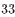. It’s given in the table that the coordinates of two points on a line in the <em>xy</em>-plane are 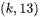 and 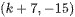. The <em>y</em>-intercept is another point on the line. The slope computed using any pair of points from the line will be the same. The slope of a line, 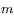, between any two points, 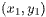 and 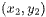, on the line can be calculated using the slope formula, 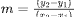. It follows that the slope of the line with the given points from the table, 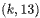 and 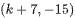, is 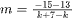, which is equivalent to 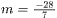, or 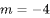. It's given that the <em>y</em>-intercept of the line is 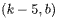. Substituting  for 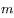 and the coordinates of the points  and 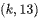 into the slope formula yields 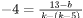, which is equivalent to 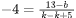, or 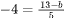. Multiplying both sides of this equation by <mjx-container alttext="5" aria-label="5" class="MathJax CtxtMenu_Attached_0" ctxtmenu_counter="279" jax="SVG" role="img" style="position: relative;" tabindex="0"><svg aria-hidden="true" focusable="false" height="1.557ex" role="img" style="vertical-align: -0.05ex;" viewbox="0 -666 500 688" width="1.131ex" xmlns="http://www.w3.org/2000/svg" xmlns:xlink="http://www.w3.org/1999/xlink"><defs><path d="M164 157Q164 133 148 117T109 101H102Q148 22 224 22Q294 22 326 82Q345 115 345 210Q345 313 318 349Q292 382 260 382H254Q176 382 136 314Q132 307 129 306T114 304Q97 304 95 310Q93 314 93 485V614Q93 664 98 664Q100 666 102 666Q103 666 123 658T178 642T253 634Q324 634 389 662Q397 666 402 666Q410 666 410 648V635Q328 538 205 538Q174 538 149 544L139 546V374Q158 388 169 396T205 412T256 420Q337 420 393 355T449 201Q449 109 385 44T229 -22Q148 -22 99 32T50 154Q50 178 61 192T84 210T107 214Q132 214 148 197T164 157Z" id="MJX-280-TEX-N-35"></path></defs><g fill="currentColor" stroke="currentColor" stroke-width="0" transform="scale(1,-1)"><g data-mml-node="math"><g data-mml-node="mn"><use data-c="35" xlink:href="#MJX-280-TEX-N-35"></use></g></g></g></svg><mjx-assistive-mml display="inline" unselectable="on"><math alttext="5" xmlns="http://www.w3.org/1998/Math/MathML"><mn>5</mn></math></mjx-assistive-mml></mjx-container> yields . Subtracting 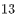 from both sides of this equation yields 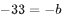. Dividing both sides of this equation by 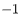 yields 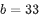. Therefore, the value of <mjx-container alttext="b" aria-label="b" class="MathJax CtxtMenu_Attached_0" ctxtmenu_counter="285" jax="SVG" role="img" style="position: relative;" tabindex="0"><svg aria-hidden="true" focusable="false" height="1.595ex" role="img" style="vertical-align: -0.025ex;" viewbox="0 -694 429 705" width="0.971ex" xmlns="http://www.w3.org/2000/svg" xmlns:xlink="http://www.w3.org/1999/xlink"><defs><path d="M73 647Q73 657 77 670T89 683Q90 683 161 688T234 694Q246 694 246 685T212 542Q204 508 195 472T180 418L176 399Q176 396 182 402Q231 442 283 442Q345 442 383 396T422 280Q422 169 343 79T173 -11Q123 -11 82 27T40 150V159Q40 180 48 217T97 414Q147 611 147 623T109 637Q104 637 101 637H96Q86 637 83 637T76 640T73 647ZM336 325V331Q336 405 275 405Q258 405 240 397T207 376T181 352T163 330L157 322L136 236Q114 150 114 114Q114 66 138 42Q154 26 178 26Q211 26 245 58Q270 81 285 114T318 219Q336 291 336 325Z" id="MJX-286-TEX-I-1D44F"></path></defs><g fill="currentColor" stroke="currentColor" stroke-width="0" transform="scale(1,-1)"><g data-mml-node="math"><g data-mml-node="mi"><use data-c="1D44F" xlink:href="#MJX-286-TEX-I-1D44F"></use></g></g></g></svg><mjx-assistive-mml display="inline" unselectable="on"><math alttext="b" xmlns="http://www.w3.org/1998/Math/MathML"><mi>b</mi></math></mjx-assistive-mml></mjx-container> is 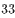.

