# Question

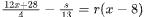

In the given equation, <mjx-container alttext="s" aria-label="s" class="MathJax CtxtMenu_Attached_0" ctxtmenu_counter="1" jax="SVG" role="img" style="position: relative;" tabindex="0"><svg aria-hidden="true" focusable="false" height="1.023ex" role="img" style="vertical-align: -0.023ex;" viewbox="0 -442 469 452" width="1.061ex" xmlns="http://www.w3.org/2000/svg" xmlns:xlink="http://www.w3.org/1999/xlink"><defs><path d="M131 289Q131 321 147 354T203 415T300 442Q362 442 390 415T419 355Q419 323 402 308T364 292Q351 292 340 300T328 326Q328 342 337 354T354 372T367 378Q368 378 368 379Q368 382 361 388T336 399T297 405Q249 405 227 379T204 326Q204 301 223 291T278 274T330 259Q396 230 396 163Q396 135 385 107T352 51T289 7T195 -10Q118 -10 86 19T53 87Q53 126 74 143T118 160Q133 160 146 151T160 120Q160 94 142 76T111 58Q109 57 108 57T107 55Q108 52 115 47T146 34T201 27Q237 27 263 38T301 66T318 97T323 122Q323 150 302 164T254 181T195 196T148 231Q131 256 131 289Z" id="MJX-2-TEX-I-1D460"></path></defs><g fill="currentColor" stroke="currentColor" stroke-width="0" transform="scale(1,-1)"><g data-mml-node="math"><g data-mml-node="mi"><use data-c="1D460" xlink:href="#MJX-2-TEX-I-1D460"></use></g></g></g></svg><mjx-assistive-mml display="inline" unselectable="on"><math alttext="s" xmlns="http://www.w3.org/1998/Math/MathML"><mi>s</mi></math></mjx-assistive-mml></mjx-container> and <mjx-container alttext="r" aria-label="r" class="MathJax CtxtMenu_Attached_0" ctxtmenu_counter="2" jax="SVG" role="img" style="position: relative;" tabindex="0"><svg aria-hidden="true" focusable="false" height="1.025ex" role="img" style="vertical-align: -0.025ex;" viewbox="0 -442 451 453" width="1.02ex" xmlns="http://www.w3.org/2000/svg" xmlns:xlink="http://www.w3.org/1999/xlink"><defs><path d="M21 287Q22 290 23 295T28 317T38 348T53 381T73 411T99 433T132 442Q161 442 183 430T214 408T225 388Q227 382 228 382T236 389Q284 441 347 441H350Q398 441 422 400Q430 381 430 363Q430 333 417 315T391 292T366 288Q346 288 334 299T322 328Q322 376 378 392Q356 405 342 405Q286 405 239 331Q229 315 224 298T190 165Q156 25 151 16Q138 -11 108 -11Q95 -11 87 -5T76 7T74 17Q74 30 114 189T154 366Q154 405 128 405Q107 405 92 377T68 316T57 280Q55 278 41 278H27Q21 284 21 287Z" id="MJX-3-TEX-I-1D45F"></path></defs><g fill="currentColor" stroke="currentColor" stroke-width="0" transform="scale(1,-1)"><g data-mml-node="math"><g data-mml-node="mi"><use data-c="1D45F" xlink:href="#MJX-3-TEX-I-1D45F"></use></g></g></g></svg><mjx-assistive-mml display="inline" unselectable="on"><math alttext="r" xmlns="http://www.w3.org/1998/Math/MathML"><mi>r</mi></math></mjx-assistive-mml></mjx-container> are constants, and 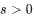. If the equation has infinitely many solutions, what is the value of <mjx-container alttext="s" aria-label="s" class="MathJax CtxtMenu_Attached_0" ctxtmenu_counter="4" jax="SVG" role="img" style="position: relative;" tabindex="0"><svg aria-hidden="true" focusable="false" height="1.023ex" role="img" style="vertical-align: -0.023ex;" viewbox="0 -442 469 452" width="1.061ex" xmlns="http://www.w3.org/2000/svg" xmlns:xlink="http://www.w3.org/1999/xlink"><defs><path d="M131 289Q131 321 147 354T203 415T300 442Q362 442 390 415T419 355Q419 323 402 308T364 292Q351 292 340 300T328 326Q328 342 337 354T354 372T367 378Q368 378 368 379Q368 382 361 388T336 399T297 405Q249 405 227 379T204 326Q204 301 223 291T278 274T330 259Q396 230 396 163Q396 135 385 107T352 51T289 7T195 -10Q118 -10 86 19T53 87Q53 126 74 143T118 160Q133 160 146 151T160 120Q160 94 142 76T111 58Q109 57 108 57T107 55Q108 52 115 47T146 34T201 27Q237 27 263 38T301 66T318 97T323 122Q323 150 302 164T254 181T195 196T148 231Q131 256 131 289Z" id="MJX-5-TEX-I-1D460"></path></defs><g fill="currentColor" stroke="currentColor" stroke-width="0" transform="scale(1,-1)"><g data-mml-node="math"><g data-mml-node="mi"><use data-c="1D460" xlink:href="#MJX-5-TEX-I-1D460"></use></g></g></g></svg><mjx-assistive-mml display="inline" unselectable="on"><math alttext="s" xmlns="http://www.w3.org/1998/Math/MathML"><mi>s</mi></math></mjx-assistive-mml></mjx-container>?

# Choices

# Answer

# Rationale
<h5 class="cb-margin-bottom-16 cb-font-weight-bold">Rationale</h5>
Correct Answer: 403

The correct answer is . For a linear equation in one variable to have infinitely many solutions, the coefficients of the variable must be equal on both sides of the equation and the constant terms must also be equal on both sides of the equation. The given equation can be rewritten as 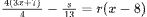, or 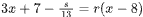. Applying the distributive property to the right-hand side of this equation yields 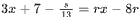. For this equation to have infinitely many solutions, the coefficients of <mjx-container alttext="x" aria-label="x" class="MathJax CtxtMenu_Attached_0" ctxtmenu_counter="9" jax="SVG" role="img" style="position: relative;" tabindex="0"><svg aria-hidden="true" focusable="false" height="1.025ex" role="img" style="vertical-align: -0.025ex;" viewbox="0 -442 572 453" width="1.294ex" xmlns="http://www.w3.org/2000/svg" xmlns:xlink="http://www.w3.org/1999/xlink"><defs><path d="M52 289Q59 331 106 386T222 442Q257 442 286 424T329 379Q371 442 430 442Q467 442 494 420T522 361Q522 332 508 314T481 292T458 288Q439 288 427 299T415 328Q415 374 465 391Q454 404 425 404Q412 404 406 402Q368 386 350 336Q290 115 290 78Q290 50 306 38T341 26Q378 26 414 59T463 140Q466 150 469 151T485 153H489Q504 153 504 145Q504 144 502 134Q486 77 440 33T333 -11Q263 -11 227 52Q186 -10 133 -10H127Q78 -10 57 16T35 71Q35 103 54 123T99 143Q142 143 142 101Q142 81 130 66T107 46T94 41L91 40Q91 39 97 36T113 29T132 26Q168 26 194 71Q203 87 217 139T245 247T261 313Q266 340 266 352Q266 380 251 392T217 404Q177 404 142 372T93 290Q91 281 88 280T72 278H58Q52 284 52 289Z" id="MJX-10-TEX-I-1D465"></path></defs><g fill="currentColor" stroke="currentColor" stroke-width="0" transform="scale(1,-1)"><g data-mml-node="math"><g data-mml-node="mi"><use data-c="1D465" xlink:href="#MJX-10-TEX-I-1D465"></use></g></g></g></svg><mjx-assistive-mml display="inline" unselectable="on"><math alttext="x" xmlns="http://www.w3.org/1998/Math/MathML"><mi>x</mi></math></mjx-assistive-mml></mjx-container> must be equal, so it follows that 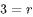. Additionally, the constant terms must be equal, which means 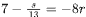. Substituting <mjx-container alttext="3" aria-label="3" class="MathJax CtxtMenu_Attached_0" ctxtmenu_counter="12" jax="SVG" role="img" style="position: relative;" tabindex="0"><svg aria-hidden="true" focusable="false" height="1.554ex" role="img" style="vertical-align: -0.05ex;" viewbox="0 -665 500 687" width="1.131ex" xmlns="http://www.w3.org/2000/svg" xmlns:xlink="http://www.w3.org/1999/xlink"><defs><path d="M127 463Q100 463 85 480T69 524Q69 579 117 622T233 665Q268 665 277 664Q351 652 390 611T430 522Q430 470 396 421T302 350L299 348Q299 347 308 345T337 336T375 315Q457 262 457 175Q457 96 395 37T238 -22Q158 -22 100 21T42 130Q42 158 60 175T105 193Q133 193 151 175T169 130Q169 119 166 110T159 94T148 82T136 74T126 70T118 67L114 66Q165 21 238 21Q293 21 321 74Q338 107 338 175V195Q338 290 274 322Q259 328 213 329L171 330L168 332Q166 335 166 348Q166 366 174 366Q202 366 232 371Q266 376 294 413T322 525V533Q322 590 287 612Q265 626 240 626Q208 626 181 615T143 592T132 580H135Q138 579 143 578T153 573T165 566T175 555T183 540T186 520Q186 498 172 481T127 463Z" id="MJX-13-TEX-N-33"></path></defs><g fill="currentColor" stroke="currentColor" stroke-width="0" transform="scale(1,-1)"><g data-mml-node="math"><g data-mml-node="mn"><use data-c="33" xlink:href="#MJX-13-TEX-N-33"></use></g></g></g></svg><mjx-assistive-mml display="inline" unselectable="on"><math alttext="3" xmlns="http://www.w3.org/1998/Math/MathML"><mn>3</mn></math></mjx-assistive-mml></mjx-container> for <mjx-container alttext="r" aria-label="r" class="MathJax CtxtMenu_Attached_0" ctxtmenu_counter="13" jax="SVG" role="img" style="position: relative;" tabindex="0"><svg aria-hidden="true" focusable="false" height="1.025ex" role="img" style="vertical-align: -0.025ex;" viewbox="0 -442 451 453" width="1.02ex" xmlns="http://www.w3.org/2000/svg" xmlns:xlink="http://www.w3.org/1999/xlink"><defs><path d="M21 287Q22 290 23 295T28 317T38 348T53 381T73 411T99 433T132 442Q161 442 183 430T214 408T225 388Q227 382 228 382T236 389Q284 441 347 441H350Q398 441 422 400Q430 381 430 363Q430 333 417 315T391 292T366 288Q346 288 334 299T322 328Q322 376 378 392Q356 405 342 405Q286 405 239 331Q229 315 224 298T190 165Q156 25 151 16Q138 -11 108 -11Q95 -11 87 -5T76 7T74 17Q74 30 114 189T154 366Q154 405 128 405Q107 405 92 377T68 316T57 280Q55 278 41 278H27Q21 284 21 287Z" id="MJX-14-TEX-I-1D45F"></path></defs><g fill="currentColor" stroke="currentColor" stroke-width="0" transform="scale(1,-1)"><g data-mml-node="math"><g data-mml-node="mi"><use data-c="1D45F" xlink:href="#MJX-14-TEX-I-1D45F"></use></g></g></g></svg><mjx-assistive-mml display="inline" unselectable="on"><math alttext="r" xmlns="http://www.w3.org/1998/Math/MathML"><mi>r</mi></math></mjx-assistive-mml></mjx-container> in this equation yields 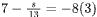, or 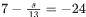. Adding 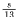 to both sides of this equation yields 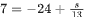. Adding  to both sides of this equation yields 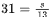. Multiplying both sides of this equation by 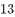 yields 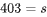. Therefore, if the equation has infinitely many solutions, the value of <mjx-container alttext="s" aria-label="s" class="MathJax CtxtMenu_Attached_0" ctxtmenu_counter="22" jax="SVG" role="img" style="position: relative;" tabindex="0"><svg aria-hidden="true" focusable="false" height="1.023ex" role="img" style="vertical-align: -0.023ex;" viewbox="0 -442 469 452" width="1.061ex" xmlns="http://www.w3.org/2000/svg" xmlns:xlink="http://www.w3.org/1999/xlink"><defs><path d="M131 289Q131 321 147 354T203 415T300 442Q362 442 390 415T419 355Q419 323 402 308T364 292Q351 292 340 300T328 326Q328 342 337 354T354 372T367 378Q368 378 368 379Q368 382 361 388T336 399T297 405Q249 405 227 379T204 326Q204 301 223 291T278 274T330 259Q396 230 396 163Q396 135 385 107T352 51T289 7T195 -10Q118 -10 86 19T53 87Q53 126 74 143T118 160Q133 160 146 151T160 120Q160 94 142 76T111 58Q109 57 108 57T107 55Q108 52 115 47T146 34T201 27Q237 27 263 38T301 66T318 97T323 122Q323 150 302 164T254 181T195 196T148 231Q131 256 131 289Z" id="MJX-23-TEX-I-1D460"></path></defs><g fill="currentColor" stroke="currentColor" stroke-width="0" transform="scale(1,-1)"><g data-mml-node="math"><g data-mml-node="mi"><use data-c="1D460" xlink:href="#MJX-23-TEX-I-1D460"></use></g></g></g></svg><mjx-assistive-mml display="inline" unselectable="on"><math alttext="s" xmlns="http://www.w3.org/1998/Math/MathML"><mi>s</mi></math></mjx-assistive-mml></mjx-container> is 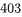.

