# Question

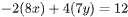

The solution to the given system of equations is 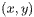. What is the value of 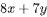?

# Choices

# Answer

# Rationale
<h5 class="cb-margin-bottom-16 cb-font-weight-bold">Rationale</h5>
Correct Answer: 3

The correct answer is <mjx-container alttext="3" aria-label="3" class="MathJax CtxtMenu_Attached_0" ctxtmenu_counter="144" jax="SVG" role="img" style="position: relative;" tabindex="0"><svg aria-hidden="true" focusable="false" height="1.554ex" role="img" style="vertical-align: -0.05ex;" viewbox="0 -665 500 687" width="1.131ex" xmlns="http://www.w3.org/2000/svg" xmlns:xlink="http://www.w3.org/1999/xlink"><defs><path d="M127 463Q100 463 85 480T69 524Q69 579 117 622T233 665Q268 665 277 664Q351 652 390 611T430 522Q430 470 396 421T302 350L299 348Q299 347 308 345T337 336T375 315Q457 262 457 175Q457 96 395 37T238 -22Q158 -22 100 21T42 130Q42 158 60 175T105 193Q133 193 151 175T169 130Q169 119 166 110T159 94T148 82T136 74T126 70T118 67L114 66Q165 21 238 21Q293 21 321 74Q338 107 338 175V195Q338 290 274 322Q259 328 213 329L171 330L168 332Q166 335 166 348Q166 366 174 366Q202 366 232 371Q266 376 294 413T322 525V533Q322 590 287 612Q265 626 240 626Q208 626 181 615T143 592T132 580H135Q138 579 143 578T153 573T165 566T175 555T183 540T186 520Q186 498 172 481T127 463Z" id="MJX-145-TEX-N-33"></path></defs><g fill="currentColor" stroke="currentColor" stroke-width="0" transform="scale(1,-1)"><g data-mml-node="math"><g data-mml-node="mn"><use data-c="33" xlink:href="#MJX-145-TEX-N-33"></use></g></g></g></svg><mjx-assistive-mml display="inline" unselectable="on"><math alttext="3" xmlns="http://www.w3.org/1998/Math/MathML"><mn>3</mn></math></mjx-assistive-mml></mjx-container>. Adding the second equation to the first equation in the given system of equations yields 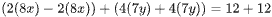, or 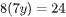. Dividing both sides of this equation by <mjx-container alttext="8" aria-label="8" class="MathJax CtxtMenu_Attached_0" ctxtmenu_counter="147" jax="SVG" role="img" style="position: relative;" tabindex="0"><svg aria-hidden="true" focusable="false" height="1.557ex" role="img" style="vertical-align: -0.05ex;" viewbox="0 -666 500 688" width="1.131ex" xmlns="http://www.w3.org/2000/svg" xmlns:xlink="http://www.w3.org/1999/xlink"><defs><path d="M70 417T70 494T124 618T248 666Q319 666 374 624T429 515Q429 485 418 459T392 417T361 389T335 371T324 363L338 354Q352 344 366 334T382 323Q457 264 457 174Q457 95 399 37T249 -22Q159 -22 101 29T43 155Q43 263 172 335L154 348Q133 361 127 368Q70 417 70 494ZM286 386L292 390Q298 394 301 396T311 403T323 413T334 425T345 438T355 454T364 471T369 491T371 513Q371 556 342 586T275 624Q268 625 242 625Q201 625 165 599T128 534Q128 511 141 492T167 463T217 431Q224 426 228 424L286 386ZM250 21Q308 21 350 55T392 137Q392 154 387 169T375 194T353 216T330 234T301 253T274 270Q260 279 244 289T218 306L210 311Q204 311 181 294T133 239T107 157Q107 98 150 60T250 21Z" id="MJX-148-TEX-N-38"></path></defs><g fill="currentColor" stroke="currentColor" stroke-width="0" transform="scale(1,-1)"><g data-mml-node="math"><g data-mml-node="mn"><use data-c="38" xlink:href="#MJX-148-TEX-N-38"></use></g></g></g></svg><mjx-assistive-mml display="inline" unselectable="on"><math alttext="8" xmlns="http://www.w3.org/1998/Math/MathML"><mn>8</mn></math></mjx-assistive-mml></mjx-container> yields 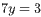. Substituting <mjx-container alttext="3" aria-label="3" class="MathJax CtxtMenu_Attached_0" ctxtmenu_counter="149" jax="SVG" role="img" style="position: relative;" tabindex="0"><svg aria-hidden="true" focusable="false" height="1.554ex" role="img" style="vertical-align: -0.05ex;" viewbox="0 -665 500 687" width="1.131ex" xmlns="http://www.w3.org/2000/svg" xmlns:xlink="http://www.w3.org/1999/xlink"><defs><path d="M127 463Q100 463 85 480T69 524Q69 579 117 622T233 665Q268 665 277 664Q351 652 390 611T430 522Q430 470 396 421T302 350L299 348Q299 347 308 345T337 336T375 315Q457 262 457 175Q457 96 395 37T238 -22Q158 -22 100 21T42 130Q42 158 60 175T105 193Q133 193 151 175T169 130Q169 119 166 110T159 94T148 82T136 74T126 70T118 67L114 66Q165 21 238 21Q293 21 321 74Q338 107 338 175V195Q338 290 274 322Q259 328 213 329L171 330L168 332Q166 335 166 348Q166 366 174 366Q202 366 232 371Q266 376 294 413T322 525V533Q322 590 287 612Q265 626 240 626Q208 626 181 615T143 592T132 580H135Q138 579 143 578T153 573T165 566T175 555T183 540T186 520Q186 498 172 481T127 463Z" id="MJX-150-TEX-N-33"></path></defs><g fill="currentColor" stroke="currentColor" stroke-width="0" transform="scale(1,-1)"><g data-mml-node="math"><g data-mml-node="mn"><use data-c="33" xlink:href="#MJX-150-TEX-N-33"></use></g></g></g></svg><mjx-assistive-mml display="inline" unselectable="on"><math alttext="3" xmlns="http://www.w3.org/1998/Math/MathML"><mn>3</mn></math></mjx-assistive-mml></mjx-container> for 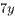 in the first equation, 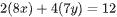, yields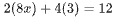, or 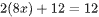. Subtracting 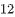 from both sides of this equation yields 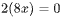. Dividing both sides of this equation by <mjx-container alttext="2" aria-label="2" class="MathJax CtxtMenu_Attached_0" ctxtmenu_counter="156" jax="SVG" role="img" style="position: relative;" tabindex="0"><svg aria-hidden="true" focusable="false" height="1.507ex" role="img" style="vertical-align: 0px;" viewbox="0 -666 500 666" width="1.131ex" xmlns="http://www.w3.org/2000/svg" xmlns:xlink="http://www.w3.org/1999/xlink"><defs><path d="M109 429Q82 429 66 447T50 491Q50 562 103 614T235 666Q326 666 387 610T449 465Q449 422 429 383T381 315T301 241Q265 210 201 149L142 93L218 92Q375 92 385 97Q392 99 409 186V189H449V186Q448 183 436 95T421 3V0H50V19V31Q50 38 56 46T86 81Q115 113 136 137Q145 147 170 174T204 211T233 244T261 278T284 308T305 340T320 369T333 401T340 431T343 464Q343 527 309 573T212 619Q179 619 154 602T119 569T109 550Q109 549 114 549Q132 549 151 535T170 489Q170 464 154 447T109 429Z" id="MJX-157-TEX-N-32"></path></defs><g fill="currentColor" stroke="currentColor" stroke-width="0" transform="scale(1,-1)"><g data-mml-node="math"><g data-mml-node="mn"><use data-c="32" xlink:href="#MJX-157-TEX-N-32"></use></g></g></g></svg><mjx-assistive-mml display="inline" unselectable="on"><math alttext="2" xmlns="http://www.w3.org/1998/Math/MathML"><mn>2</mn></math></mjx-assistive-mml></mjx-container> yields 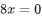. Substituting <mjx-container alttext="0" aria-label="0" class="MathJax CtxtMenu_Attached_0" ctxtmenu_counter="158" jax="SVG" role="img" style="position: relative;" tabindex="0"><svg aria-hidden="true" focusable="false" height="1.557ex" role="img" style="vertical-align: -0.05ex;" viewbox="0 -666 500 688" width="1.131ex" xmlns="http://www.w3.org/2000/svg" xmlns:xlink="http://www.w3.org/1999/xlink"><defs><path d="M96 585Q152 666 249 666Q297 666 345 640T423 548Q460 465 460 320Q460 165 417 83Q397 41 362 16T301 -15T250 -22Q224 -22 198 -16T137 16T82 83Q39 165 39 320Q39 494 96 585ZM321 597Q291 629 250 629Q208 629 178 597Q153 571 145 525T137 333Q137 175 145 125T181 46Q209 16 250 16Q290 16 318 46Q347 76 354 130T362 333Q362 478 354 524T321 597Z" id="MJX-159-TEX-N-30"></path></defs><g fill="currentColor" stroke="currentColor" stroke-width="0" transform="scale(1,-1)"><g data-mml-node="math"><g data-mml-node="mn"><use data-c="30" xlink:href="#MJX-159-TEX-N-30"></use></g></g></g></svg><mjx-assistive-mml display="inline" unselectable="on"><math alttext="0" xmlns="http://www.w3.org/1998/Math/MathML"><mn>0</mn></math></mjx-assistive-mml></mjx-container> for 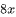 and <mjx-container alttext="3" aria-label="3" class="MathJax CtxtMenu_Attached_0" ctxtmenu_counter="160" jax="SVG" role="img" style="position: relative;" tabindex="0"><svg aria-hidden="true" focusable="false" height="1.554ex" role="img" style="vertical-align: -0.05ex;" viewbox="0 -665 500 687" width="1.131ex" xmlns="http://www.w3.org/2000/svg" xmlns:xlink="http://www.w3.org/1999/xlink"><defs><path d="M127 463Q100 463 85 480T69 524Q69 579 117 622T233 665Q268 665 277 664Q351 652 390 611T430 522Q430 470 396 421T302 350L299 348Q299 347 308 345T337 336T375 315Q457 262 457 175Q457 96 395 37T238 -22Q158 -22 100 21T42 130Q42 158 60 175T105 193Q133 193 151 175T169 130Q169 119 166 110T159 94T148 82T136 74T126 70T118 67L114 66Q165 21 238 21Q293 21 321 74Q338 107 338 175V195Q338 290 274 322Q259 328 213 329L171 330L168 332Q166 335 166 348Q166 366 174 366Q202 366 232 371Q266 376 294 413T322 525V533Q322 590 287 612Q265 626 240 626Q208 626 181 615T143 592T132 580H135Q138 579 143 578T153 573T165 566T175 555T183 540T186 520Q186 498 172 481T127 463Z" id="MJX-161-TEX-N-33"></path></defs><g fill="currentColor" stroke="currentColor" stroke-width="0" transform="scale(1,-1)"><g data-mml-node="math"><g data-mml-node="mn"><use data-c="33" xlink:href="#MJX-161-TEX-N-33"></use></g></g></g></svg><mjx-assistive-mml display="inline" unselectable="on"><math alttext="3" xmlns="http://www.w3.org/1998/Math/MathML"><mn>3</mn></math></mjx-assistive-mml></mjx-container> for  in the expression 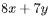 yields 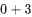, or <mjx-container alttext="3" aria-label="3" class="MathJax CtxtMenu_Attached_0" ctxtmenu_counter="164" jax="SVG" role="img" style="position: relative;" tabindex="0"><svg aria-hidden="true" focusable="false" height="1.554ex" role="img" style="vertical-align: -0.05ex;" viewbox="0 -665 500 687" width="1.131ex" xmlns="http://www.w3.org/2000/svg" xmlns:xlink="http://www.w3.org/1999/xlink"><defs><path d="M127 463Q100 463 85 480T69 524Q69 579 117 622T233 665Q268 665 277 664Q351 652 390 611T430 522Q430 470 396 421T302 350L299 348Q299 347 308 345T337 336T375 315Q457 262 457 175Q457 96 395 37T238 -22Q158 -22 100 21T42 130Q42 158 60 175T105 193Q133 193 151 175T169 130Q169 119 166 110T159 94T148 82T136 74T126 70T118 67L114 66Q165 21 238 21Q293 21 321 74Q338 107 338 175V195Q338 290 274 322Q259 328 213 329L171 330L168 332Q166 335 166 348Q166 366 174 366Q202 366 232 371Q266 376 294 413T322 525V533Q322 590 287 612Q265 626 240 626Q208 626 181 615T143 592T132 580H135Q138 579 143 578T153 573T165 566T175 555T183 540T186 520Q186 498 172 481T127 463Z" id="MJX-165-TEX-N-33"></path></defs><g fill="currentColor" stroke="currentColor" stroke-width="0" transform="scale(1,-1)"><g data-mml-node="math"><g data-mml-node="mn"><use data-c="33" xlink:href="#MJX-165-TEX-N-33"></use></g></g></g></svg><mjx-assistive-mml display="inline" unselectable="on"><math alttext="3" xmlns="http://www.w3.org/1998/Math/MathML"><mn>3</mn></math></mjx-assistive-mml></mjx-container>. Therefore, the value of  is <mjx-container alttext="3" aria-label="3" class="MathJax CtxtMenu_Attached_0" ctxtmenu_counter="166" jax="SVG" role="img" style="position: relative;" tabindex="0"><svg aria-hidden="true" focusable="false" height="1.554ex" role="img" style="vertical-align: -0.05ex;" viewbox="0 -665 500 687" width="1.131ex" xmlns="http://www.w3.org/2000/svg" xmlns:xlink="http://www.w3.org/1999/xlink"><defs><path d="M127 463Q100 463 85 480T69 524Q69 579 117 622T233 665Q268 665 277 664Q351 652 390 611T430 522Q430 470 396 421T302 350L299 348Q299 347 308 345T337 336T375 315Q457 262 457 175Q457 96 395 37T238 -22Q158 -22 100 21T42 130Q42 158 60 175T105 193Q133 193 151 175T169 130Q169 119 166 110T159 94T148 82T136 74T126 70T118 67L114 66Q165 21 238 21Q293 21 321 74Q338 107 338 175V195Q338 290 274 322Q259 328 213 329L171 330L168 332Q166 335 166 348Q166 366 174 366Q202 366 232 371Q266 376 294 413T322 525V533Q322 590 287 612Q265 626 240 626Q208 626 181 615T143 592T132 580H135Q138 579 143 578T153 573T165 566T175 555T183 540T186 520Q186 498 172 481T127 463Z" id="MJX-167-TEX-N-33"></path></defs><g fill="currentColor" stroke="currentColor" stroke-width="0" transform="scale(1,-1)"><g data-mml-node="math"><g data-mml-node="mn"><use data-c="33" xlink:href="#MJX-167-TEX-N-33"></use></g></g></g></svg><mjx-assistive-mml display="inline" unselectable="on"><math alttext="3" xmlns="http://www.w3.org/1998/Math/MathML"><mn>3</mn></math></mjx-assistive-mml></mjx-container>.

