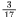
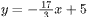
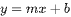
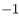
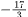
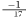
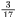
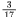

# Question

Line <mjx-container alttext="k" aria-label="k" class="MathJax CtxtMenu_Attached_0" ctxtmenu_counter="117" jax="SVG" role="img" style="position: relative;" tabindex="0"><svg aria-hidden="true" focusable="false" height="1.595ex" role="img" style="vertical-align: -0.025ex;" viewbox="0 -694 521 705" width="1.179ex" xmlns="http://www.w3.org/2000/svg" xmlns:xlink="http://www.w3.org/1999/xlink"><defs><path d="M121 647Q121 657 125 670T137 683Q138 683 209 688T282 694Q294 694 294 686Q294 679 244 477Q194 279 194 272Q213 282 223 291Q247 309 292 354T362 415Q402 442 438 442Q468 442 485 423T503 369Q503 344 496 327T477 302T456 291T438 288Q418 288 406 299T394 328Q394 353 410 369T442 390L458 393Q446 405 434 405H430Q398 402 367 380T294 316T228 255Q230 254 243 252T267 246T293 238T320 224T342 206T359 180T365 147Q365 130 360 106T354 66Q354 26 381 26Q429 26 459 145Q461 153 479 153H483Q499 153 499 144Q499 139 496 130Q455 -11 378 -11Q333 -11 305 15T277 90Q277 108 280 121T283 145Q283 167 269 183T234 206T200 217T182 220H180Q168 178 159 139T145 81T136 44T129 20T122 7T111 -2Q98 -11 83 -11Q66 -11 57 -1T48 16Q48 26 85 176T158 471L195 616Q196 629 188 632T149 637H144Q134 637 131 637T124 640T121 647Z" id="MJX-118-TEX-I-1D458"></path></defs><g fill="currentColor" stroke="currentColor" stroke-width="0" transform="scale(1,-1)"><g data-mml-node="math"><g data-mml-node="mi"><use data-c="1D458" xlink:href="#MJX-118-TEX-I-1D458"></use></g></g></g></svg><mjx-assistive-mml display="inline" unselectable="on"><math alttext="k" xmlns="http://www.w3.org/1998/Math/MathML"><mi>k</mi></math></mjx-assistive-mml></mjx-container> is defined by . Line <mjx-container alttext="j" aria-label="j" class="MathJax CtxtMenu_Attached_0" ctxtmenu_counter="119" jax="SVG" role="img" style="position: relative;" tabindex="0"><svg aria-hidden="true" focusable="false" height="1.957ex" role="img" style="vertical-align: -0.462ex;" viewbox="0 -661 412 865" width="0.932ex" xmlns="http://www.w3.org/2000/svg" xmlns:xlink="http://www.w3.org/1999/xlink"><defs><path d="M297 596Q297 627 318 644T361 661Q378 661 389 651T403 623Q403 595 384 576T340 557Q322 557 310 567T297 596ZM288 376Q288 405 262 405Q240 405 220 393T185 362T161 325T144 293L137 279Q135 278 121 278H107Q101 284 101 286T105 299Q126 348 164 391T252 441Q253 441 260 441T272 442Q296 441 316 432Q341 418 354 401T367 348V332L318 133Q267 -67 264 -75Q246 -125 194 -164T75 -204Q25 -204 7 -183T-12 -137Q-12 -110 7 -91T53 -71Q70 -71 82 -81T95 -112Q95 -148 63 -167Q69 -168 77 -168Q111 -168 139 -140T182 -74L193 -32Q204 11 219 72T251 197T278 308T289 365Q289 372 288 376Z" id="MJX-120-TEX-I-1D457"></path></defs><g fill="currentColor" stroke="currentColor" stroke-width="0" transform="scale(1,-1)"><g data-mml-node="math"><g data-mml-node="mi"><use data-c="1D457" xlink:href="#MJX-120-TEX-I-1D457"></use></g></g></g></svg><mjx-assistive-mml display="inline" unselectable="on"><math alttext="j" xmlns="http://www.w3.org/1998/Math/MathML"><mi>j</mi></math></mjx-assistive-mml></mjx-container> is perpendicular to line <mjx-container alttext="k" aria-label="k" class="MathJax CtxtMenu_Attached_0" ctxtmenu_counter="120" jax="SVG" role="img" style="position: relative;" tabindex="0"><svg aria-hidden="true" focusable="false" height="1.595ex" role="img" style="vertical-align: -0.025ex;" viewbox="0 -694 521 705" width="1.179ex" xmlns="http://www.w3.org/2000/svg" xmlns:xlink="http://www.w3.org/1999/xlink"><defs><path d="M121 647Q121 657 125 670T137 683Q138 683 209 688T282 694Q294 694 294 686Q294 679 244 477Q194 279 194 272Q213 282 223 291Q247 309 292 354T362 415Q402 442 438 442Q468 442 485 423T503 369Q503 344 496 327T477 302T456 291T438 288Q418 288 406 299T394 328Q394 353 410 369T442 390L458 393Q446 405 434 405H430Q398 402 367 380T294 316T228 255Q230 254 243 252T267 246T293 238T320 224T342 206T359 180T365 147Q365 130 360 106T354 66Q354 26 381 26Q429 26 459 145Q461 153 479 153H483Q499 153 499 144Q499 139 496 130Q455 -11 378 -11Q333 -11 305 15T277 90Q277 108 280 121T283 145Q283 167 269 183T234 206T200 217T182 220H180Q168 178 159 139T145 81T136 44T129 20T122 7T111 -2Q98 -11 83 -11Q66 -11 57 -1T48 16Q48 26 85 176T158 471L195 616Q196 629 188 632T149 637H144Q134 637 131 637T124 640T121 647Z" id="MJX-121-TEX-I-1D458"></path></defs><g fill="currentColor" stroke="currentColor" stroke-width="0" transform="scale(1,-1)"><g data-mml-node="math"><g data-mml-node="mi"><use data-c="1D458" xlink:href="#MJX-121-TEX-I-1D458"></use></g></g></g></svg><mjx-assistive-mml display="inline" unselectable="on"><math alttext="k" xmlns="http://www.w3.org/1998/Math/MathML"><mi>k</mi></math></mjx-assistive-mml></mjx-container> in the <em>xy</em>-plane. What is the slope of line <mjx-container alttext="j" aria-label="j" class="MathJax CtxtMenu_Attached_0" ctxtmenu_counter="121" jax="SVG" role="img" style="position: relative;" tabindex="0"><svg aria-hidden="true" focusable="false" height="1.957ex" role="img" style="vertical-align: -0.462ex;" viewbox="0 -661 412 865" width="0.932ex" xmlns="http://www.w3.org/2000/svg" xmlns:xlink="http://www.w3.org/1999/xlink"><defs><path d="M297 596Q297 627 318 644T361 661Q378 661 389 651T403 623Q403 595 384 576T340 557Q322 557 310 567T297 596ZM288 376Q288 405 262 405Q240 405 220 393T185 362T161 325T144 293L137 279Q135 278 121 278H107Q101 284 101 286T105 299Q126 348 164 391T252 441Q253 441 260 441T272 442Q296 441 316 432Q341 418 354 401T367 348V332L318 133Q267 -67 264 -75Q246 -125 194 -164T75 -204Q25 -204 7 -183T-12 -137Q-12 -110 7 -91T53 -71Q70 -71 82 -81T95 -112Q95 -148 63 -167Q69 -168 77 -168Q111 -168 139 -140T182 -74L193 -32Q204 11 219 72T251 197T278 308T289 365Q289 372 288 376Z" id="MJX-122-TEX-I-1D457"></path></defs><g fill="currentColor" stroke="currentColor" stroke-width="0" transform="scale(1,-1)"><g data-mml-node="math"><g data-mml-node="mi"><use data-c="1D457" xlink:href="#MJX-122-TEX-I-1D457"></use></g></g></g></svg><mjx-assistive-mml display="inline" unselectable="on"><math alttext="j" xmlns="http://www.w3.org/1998/Math/MathML"><mi>j</mi></math></mjx-assistive-mml></mjx-container>?

# Choices

# Answer

# Rationale
<h5 class="cb-margin-bottom-16 cb-font-weight-bold">Rationale</h5>
Correct Answer: .1764, .1765, 3/17

The correct answer is . It’s given that line <mjx-container alttext="j" aria-label="j" class="MathJax CtxtMenu_Attached_0" ctxtmenu_counter="123" jax="SVG" role="img" style="position: relative;" tabindex="0"><svg aria-hidden="true" focusable="false" height="1.957ex" role="img" style="vertical-align: -0.462ex;" viewbox="0 -661 412 865" width="0.932ex" xmlns="http://www.w3.org/2000/svg" xmlns:xlink="http://www.w3.org/1999/xlink"><defs><path d="M297 596Q297 627 318 644T361 661Q378 661 389 651T403 623Q403 595 384 576T340 557Q322 557 310 567T297 596ZM288 376Q288 405 262 405Q240 405 220 393T185 362T161 325T144 293L137 279Q135 278 121 278H107Q101 284 101 286T105 299Q126 348 164 391T252 441Q253 441 260 441T272 442Q296 441 316 432Q341 418 354 401T367 348V332L318 133Q267 -67 264 -75Q246 -125 194 -164T75 -204Q25 -204 7 -183T-12 -137Q-12 -110 7 -91T53 -71Q70 -71 82 -81T95 -112Q95 -148 63 -167Q69 -168 77 -168Q111 -168 139 -140T182 -74L193 -32Q204 11 219 72T251 197T278 308T289 365Q289 372 288 376Z" id="MJX-124-TEX-I-1D457"></path></defs><g fill="currentColor" stroke="currentColor" stroke-width="0" transform="scale(1,-1)"><g data-mml-node="math"><g data-mml-node="mi"><use data-c="1D457" xlink:href="#MJX-124-TEX-I-1D457"></use></g></g></g></svg><mjx-assistive-mml display="inline" unselectable="on"><math alttext="j" xmlns="http://www.w3.org/1998/Math/MathML"><mi>j</mi></math></mjx-assistive-mml></mjx-container> is perpendicular to line <mjx-container alttext="k" aria-label="k" class="MathJax CtxtMenu_Attached_0" ctxtmenu_counter="124" jax="SVG" role="img" style="position: relative;" tabindex="0"><svg aria-hidden="true" focusable="false" height="1.595ex" role="img" style="vertical-align: -0.025ex;" viewbox="0 -694 521 705" width="1.179ex" xmlns="http://www.w3.org/2000/svg" xmlns:xlink="http://www.w3.org/1999/xlink"><defs><path d="M121 647Q121 657 125 670T137 683Q138 683 209 688T282 694Q294 694 294 686Q294 679 244 477Q194 279 194 272Q213 282 223 291Q247 309 292 354T362 415Q402 442 438 442Q468 442 485 423T503 369Q503 344 496 327T477 302T456 291T438 288Q418 288 406 299T394 328Q394 353 410 369T442 390L458 393Q446 405 434 405H430Q398 402 367 380T294 316T228 255Q230 254 243 252T267 246T293 238T320 224T342 206T359 180T365 147Q365 130 360 106T354 66Q354 26 381 26Q429 26 459 145Q461 153 479 153H483Q499 153 499 144Q499 139 496 130Q455 -11 378 -11Q333 -11 305 15T277 90Q277 108 280 121T283 145Q283 167 269 183T234 206T200 217T182 220H180Q168 178 159 139T145 81T136 44T129 20T122 7T111 -2Q98 -11 83 -11Q66 -11 57 -1T48 16Q48 26 85 176T158 471L195 616Q196 629 188 632T149 637H144Q134 637 131 637T124 640T121 647Z" id="MJX-125-TEX-I-1D458"></path></defs><g fill="currentColor" stroke="currentColor" stroke-width="0" transform="scale(1,-1)"><g data-mml-node="math"><g data-mml-node="mi"><use data-c="1D458" xlink:href="#MJX-125-TEX-I-1D458"></use></g></g></g></svg><mjx-assistive-mml display="inline" unselectable="on"><math alttext="k" xmlns="http://www.w3.org/1998/Math/MathML"><mi>k</mi></math></mjx-assistive-mml></mjx-container> in the <em>xy</em>-plane. This means that the slope of line <mjx-container alttext="j" aria-label="j" class="MathJax CtxtMenu_Attached_0" ctxtmenu_counter="125" jax="SVG" role="img" style="position: relative;" tabindex="0"><svg aria-hidden="true" focusable="false" height="1.957ex" role="img" style="vertical-align: -0.462ex;" viewbox="0 -661 412 865" width="0.932ex" xmlns="http://www.w3.org/2000/svg" xmlns:xlink="http://www.w3.org/1999/xlink"><defs><path d="M297 596Q297 627 318 644T361 661Q378 661 389 651T403 623Q403 595 384 576T340 557Q322 557 310 567T297 596ZM288 376Q288 405 262 405Q240 405 220 393T185 362T161 325T144 293L137 279Q135 278 121 278H107Q101 284 101 286T105 299Q126 348 164 391T252 441Q253 441 260 441T272 442Q296 441 316 432Q341 418 354 401T367 348V332L318 133Q267 -67 264 -75Q246 -125 194 -164T75 -204Q25 -204 7 -183T-12 -137Q-12 -110 7 -91T53 -71Q70 -71 82 -81T95 -112Q95 -148 63 -167Q69 -168 77 -168Q111 -168 139 -140T182 -74L193 -32Q204 11 219 72T251 197T278 308T289 365Q289 372 288 376Z" id="MJX-126-TEX-I-1D457"></path></defs><g fill="currentColor" stroke="currentColor" stroke-width="0" transform="scale(1,-1)"><g data-mml-node="math"><g data-mml-node="mi"><use data-c="1D457" xlink:href="#MJX-126-TEX-I-1D457"></use></g></g></g></svg><mjx-assistive-mml display="inline" unselectable="on"><math alttext="j" xmlns="http://www.w3.org/1998/Math/MathML"><mi>j</mi></math></mjx-assistive-mml></mjx-container> is the negative reciprocal of the slope of line <mjx-container alttext="k" aria-label="k" class="MathJax CtxtMenu_Attached_0" ctxtmenu_counter="126" jax="SVG" role="img" style="position: relative;" tabindex="0"><svg aria-hidden="true" focusable="false" height="1.595ex" role="img" style="vertical-align: -0.025ex;" viewbox="0 -694 521 705" width="1.179ex" xmlns="http://www.w3.org/2000/svg" xmlns:xlink="http://www.w3.org/1999/xlink"><defs><path d="M121 647Q121 657 125 670T137 683Q138 683 209 688T282 694Q294 694 294 686Q294 679 244 477Q194 279 194 272Q213 282 223 291Q247 309 292 354T362 415Q402 442 438 442Q468 442 485 423T503 369Q503 344 496 327T477 302T456 291T438 288Q418 288 406 299T394 328Q394 353 410 369T442 390L458 393Q446 405 434 405H430Q398 402 367 380T294 316T228 255Q230 254 243 252T267 246T293 238T320 224T342 206T359 180T365 147Q365 130 360 106T354 66Q354 26 381 26Q429 26 459 145Q461 153 479 153H483Q499 153 499 144Q499 139 496 130Q455 -11 378 -11Q333 -11 305 15T277 90Q277 108 280 121T283 145Q283 167 269 183T234 206T200 217T182 220H180Q168 178 159 139T145 81T136 44T129 20T122 7T111 -2Q98 -11 83 -11Q66 -11 57 -1T48 16Q48 26 85 176T158 471L195 616Q196 629 188 632T149 637H144Q134 637 131 637T124 640T121 647Z" id="MJX-127-TEX-I-1D458"></path></defs><g fill="currentColor" stroke="currentColor" stroke-width="0" transform="scale(1,-1)"><g data-mml-node="math"><g data-mml-node="mi"><use data-c="1D458" xlink:href="#MJX-127-TEX-I-1D458"></use></g></g></g></svg><mjx-assistive-mml display="inline" unselectable="on"><math alttext="k" xmlns="http://www.w3.org/1998/Math/MathML"><mi>k</mi></math></mjx-assistive-mml></mjx-container>. The equation of line <mjx-container alttext="k" aria-label="k" class="MathJax CtxtMenu_Attached_0" ctxtmenu_counter="127" jax="SVG" role="img" style="position: relative;" tabindex="0"><svg aria-hidden="true" focusable="false" height="1.595ex" role="img" style="vertical-align: -0.025ex;" viewbox="0 -694 521 705" width="1.179ex" xmlns="http://www.w3.org/2000/svg" xmlns:xlink="http://www.w3.org/1999/xlink"><defs><path d="M121 647Q121 657 125 670T137 683Q138 683 209 688T282 694Q294 694 294 686Q294 679 244 477Q194 279 194 272Q213 282 223 291Q247 309 292 354T362 415Q402 442 438 442Q468 442 485 423T503 369Q503 344 496 327T477 302T456 291T438 288Q418 288 406 299T394 328Q394 353 410 369T442 390L458 393Q446 405 434 405H430Q398 402 367 380T294 316T228 255Q230 254 243 252T267 246T293 238T320 224T342 206T359 180T365 147Q365 130 360 106T354 66Q354 26 381 26Q429 26 459 145Q461 153 479 153H483Q499 153 499 144Q499 139 496 130Q455 -11 378 -11Q333 -11 305 15T277 90Q277 108 280 121T283 145Q283 167 269 183T234 206T200 217T182 220H180Q168 178 159 139T145 81T136 44T129 20T122 7T111 -2Q98 -11 83 -11Q66 -11 57 -1T48 16Q48 26 85 176T158 471L195 616Q196 629 188 632T149 637H144Q134 637 131 637T124 640T121 647Z" id="MJX-128-TEX-I-1D458"></path></defs><g fill="currentColor" stroke="currentColor" stroke-width="0" transform="scale(1,-1)"><g data-mml-node="math"><g data-mml-node="mi"><use data-c="1D458" xlink:href="#MJX-128-TEX-I-1D458"></use></g></g></g></svg><mjx-assistive-mml display="inline" unselectable="on"><math alttext="k" xmlns="http://www.w3.org/1998/Math/MathML"><mi>k</mi></math></mjx-assistive-mml></mjx-container>, , is written in slope-intercept form , where  is the slope of the line and <mjx-container alttext="b" aria-label="b" class="MathJax CtxtMenu_Attached_0" ctxtmenu_counter="131" jax="SVG" role="img" style="position: relative;" tabindex="0"><svg aria-hidden="true" focusable="false" height="1.595ex" role="img" style="vertical-align: -0.025ex;" viewbox="0 -694 429 705" width="0.971ex" xmlns="http://www.w3.org/2000/svg" xmlns:xlink="http://www.w3.org/1999/xlink"><defs><path d="M73 647Q73 657 77 670T89 683Q90 683 161 688T234 694Q246 694 246 685T212 542Q204 508 195 472T180 418L176 399Q176 396 182 402Q231 442 283 442Q345 442 383 396T422 280Q422 169 343 79T173 -11Q123 -11 82 27T40 150V159Q40 180 48 217T97 414Q147 611 147 623T109 637Q104 637 101 637H96Q86 637 83 637T76 640T73 647ZM336 325V331Q336 405 275 405Q258 405 240 397T207 376T181 352T163 330L157 322L136 236Q114 150 114 114Q114 66 138 42Q154 26 178 26Q211 26 245 58Q270 81 285 114T318 219Q336 291 336 325Z" id="MJX-132-TEX-I-1D44F"></path></defs><g fill="currentColor" stroke="currentColor" stroke-width="0" transform="scale(1,-1)"><g data-mml-node="math"><g data-mml-node="mi"><use data-c="1D44F" xlink:href="#MJX-132-TEX-I-1D44F"></use></g></g></g></svg><mjx-assistive-mml display="inline" unselectable="on"><math alttext="b" xmlns="http://www.w3.org/1998/Math/MathML"><mi>b</mi></math></mjx-assistive-mml></mjx-container> is the <em>y</em>-coordinate of the <em>y</em>-intercept of the line. It follows that the slope of line <mjx-container alttext="k" aria-label="k" class="MathJax CtxtMenu_Attached_0" ctxtmenu_counter="132" jax="SVG" role="img" style="position: relative;" tabindex="0"><svg aria-hidden="true" focusable="false" height="1.595ex" role="img" style="vertical-align: -0.025ex;" viewbox="0 -694 521 705" width="1.179ex" xmlns="http://www.w3.org/2000/svg" xmlns:xlink="http://www.w3.org/1999/xlink"><defs><path d="M121 647Q121 657 125 670T137 683Q138 683 209 688T282 694Q294 694 294 686Q294 679 244 477Q194 279 194 272Q213 282 223 291Q247 309 292 354T362 415Q402 442 438 442Q468 442 485 423T503 369Q503 344 496 327T477 302T456 291T438 288Q418 288 406 299T394 328Q394 353 410 369T442 390L458 393Q446 405 434 405H430Q398 402 367 380T294 316T228 255Q230 254 243 252T267 246T293 238T320 224T342 206T359 180T365 147Q365 130 360 106T354 66Q354 26 381 26Q429 26 459 145Q461 153 479 153H483Q499 153 499 144Q499 139 496 130Q455 -11 378 -11Q333 -11 305 15T277 90Q277 108 280 121T283 145Q283 167 269 183T234 206T200 217T182 220H180Q168 178 159 139T145 81T136 44T129 20T122 7T111 -2Q98 -11 83 -11Q66 -11 57 -1T48 16Q48 26 85 176T158 471L195 616Q196 629 188 632T149 637H144Q134 637 131 637T124 640T121 647Z" id="MJX-133-TEX-I-1D458"></path></defs><g fill="currentColor" stroke="currentColor" stroke-width="0" transform="scale(1,-1)"><g data-mml-node="math"><g data-mml-node="mi"><use data-c="1D458" xlink:href="#MJX-133-TEX-I-1D458"></use></g></g></g></svg><mjx-assistive-mml display="inline" unselectable="on"><math alttext="k" xmlns="http://www.w3.org/1998/Math/MathML"><mi>k</mi></math></mjx-assistive-mml></mjx-container> is . The negative reciprocal of a number is  divided by the number. Therefore, the negative reciprocal of  is , or . Thus, the slope of line <mjx-container alttext="j" aria-label="j" class="MathJax CtxtMenu_Attached_0" ctxtmenu_counter="138" jax="SVG" role="img" style="position: relative;" tabindex="0"><svg aria-hidden="true" focusable="false" height="1.957ex" role="img" style="vertical-align: -0.462ex;" viewbox="0 -661 412 865" width="0.932ex" xmlns="http://www.w3.org/2000/svg" xmlns:xlink="http://www.w3.org/1999/xlink"><defs><path d="M297 596Q297 627 318 644T361 661Q378 661 389 651T403 623Q403 595 384 576T340 557Q322 557 310 567T297 596ZM288 376Q288 405 262 405Q240 405 220 393T185 362T161 325T144 293L137 279Q135 278 121 278H107Q101 284 101 286T105 299Q126 348 164 391T252 441Q253 441 260 441T272 442Q296 441 316 432Q341 418 354 401T367 348V332L318 133Q267 -67 264 -75Q246 -125 194 -164T75 -204Q25 -204 7 -183T-12 -137Q-12 -110 7 -91T53 -71Q70 -71 82 -81T95 -112Q95 -148 63 -167Q69 -168 77 -168Q111 -168 139 -140T182 -74L193 -32Q204 11 219 72T251 197T278 308T289 365Q289 372 288 376Z" id="MJX-139-TEX-I-1D457"></path></defs><g fill="currentColor" stroke="currentColor" stroke-width="0" transform="scale(1,-1)"><g data-mml-node="math"><g data-mml-node="mi"><use data-c="1D457" xlink:href="#MJX-139-TEX-I-1D457"></use></g></g></g></svg><mjx-assistive-mml display="inline" unselectable="on"><math alttext="j" xmlns="http://www.w3.org/1998/Math/MathML"><mi>j</mi></math></mjx-assistive-mml></mjx-container> is . Note that 3/17, .1764, .1765, and 0.176 are examples of ways to enter a correct answer.

