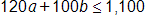
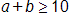
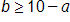
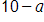
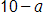
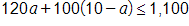
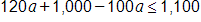
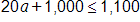
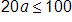
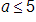

# Question

A cargo helicopter delivers only 100-pound packages and 120-pound packages. For each delivery trip, the helicopter must carry at least 10 packages, and the total weight of the packages can be at most 1,100 pounds. What is the maximum number of 120-pound packages that the helicopter can carry per trip?

# Choices
* **A** 

2

* **B** 

4

* **C** 

5

* **D** 

6

# Answer

# Rationale
<h5 class="cb-margin-bottom-16 cb-font-weight-bold">Rationale</h5>
Correct Answer: C

Choice C is correct. Let a equal the number of 120-pound packages, and let b equal the number of 100-pound packages. It’s given that the total weight of the packages can be at most 1,100 pounds: the inequality  represents this situation. It’s also given that the helicopter must carry at least 10 packages: the inequality  represents this situation. Values of a and b that satisfy these two inequalities represent the allowable numbers of 120-pound packages and 100-pound packages the helicopter can transport. To maximize the number of 120-pound packages, a, in the helicopter, the number of 100-pound packages, b, in the helicopter needs to be minimized. Expressing b in terms of a in the second inequality yields , so the minimum value of b is equal to . Substituting  for b in the first inequality results in . Using the distributive property to rewrite this inequality yields , or . Subtracting 1,000 from both sides of this inequality yields . Dividing both sides of this inequality by 20 results in . This means that the maximum number of 120-pound packages that the helicopter can carry per trip is 5.

Choices A, B, and D are incorrect and may result from incorrectly creating or solving the system of inequalities.

